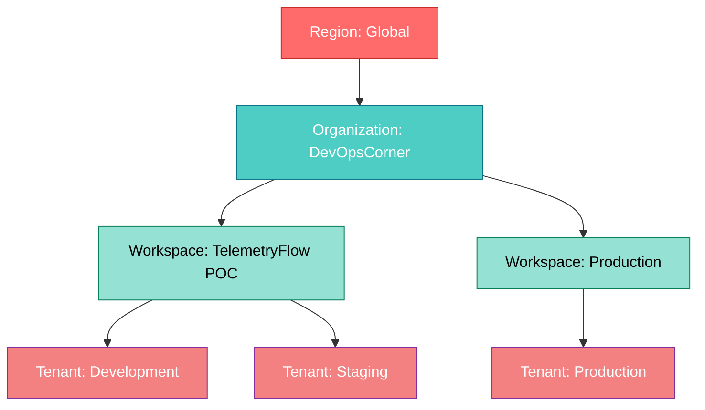
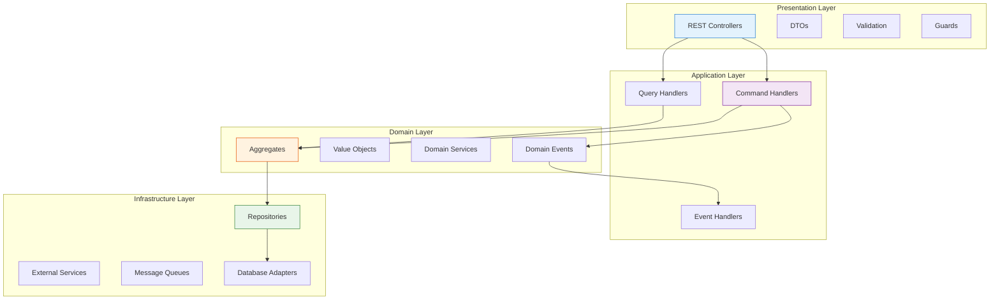
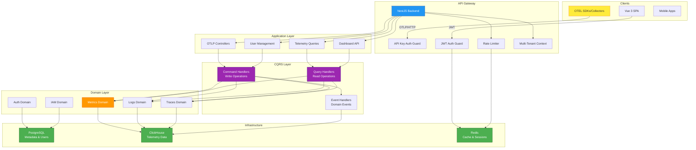
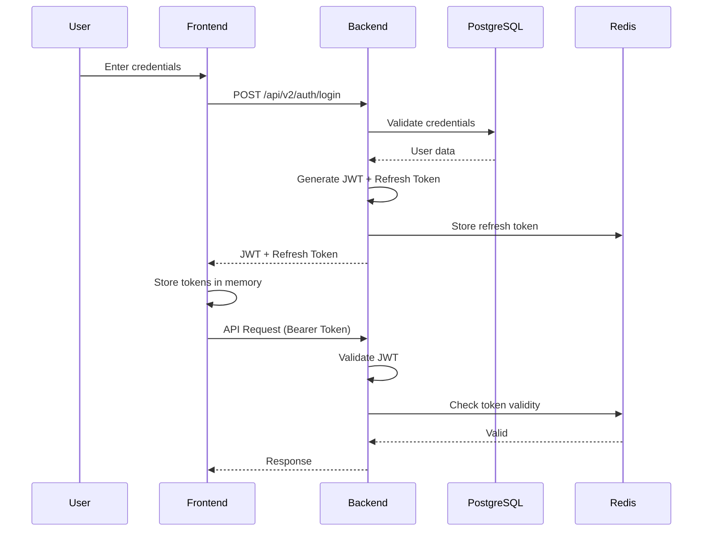
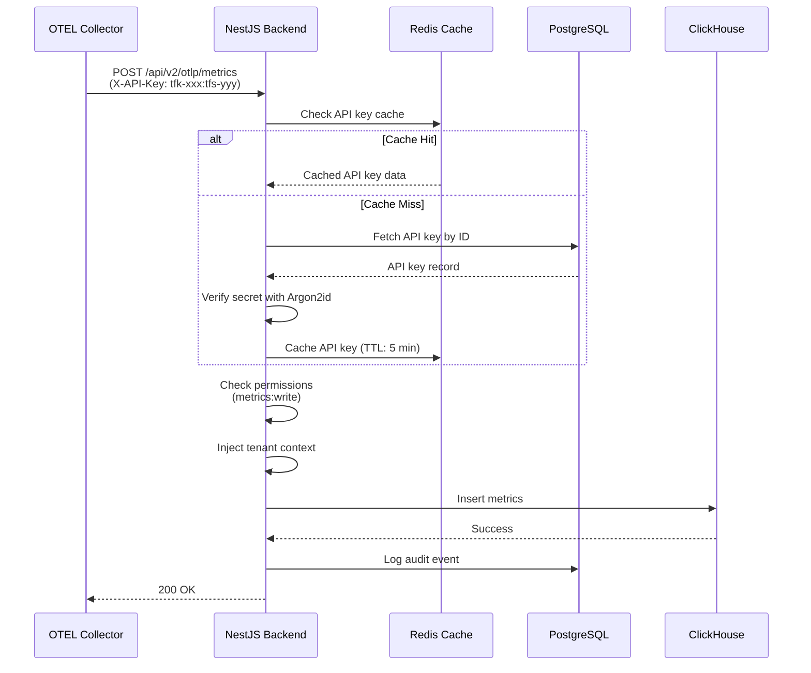

# 👋 Welcome to TelemetryFlow Platform

<div align="center">
  <picture>
    <source media="(prefers-color-scheme: dark)" srcset="docs/assets/tfo-logo-dark.svg">
    <source media="(prefers-color-scheme: light)" srcset="docs/assets/tfo-logo-light.svg">
    
  </picture>

  <h3>Enterprise-Grade Observability Platform for Modern Cloud Infrastructure</h3>

  <p>
    <strong>100% OpenTelemetry Compliant</strong> • Built with <strong>DDD/CQRS</strong> • Production-Ready
  </p>

  [](../CHANGELOG.md)
  [](../LICENSE)
  [](https://nestjs.com/)
  [](https://vuejs.org/)
  [](https://www.typescriptlang.org/)
  [](https://clickhouse.com/)
  [](https://opentelemetry.io/)
  [](docs-ddd-backend/)
  [](../backend/src/modules/iam/)

</div>

---

## 🎯 What is TelemetryFlow?

**TelemetryFlow** is an enterprise-grade observability platform that provides comprehensive monitoring, logging, and tracing capabilities for modern cloud-native applications. Built from the ground up with **Domain-Driven Design (DDD)** and **CQRS patterns**, it delivers industrial-strength reliability with developer-friendly APIs.

### 🌟 Why Choose TelemetryFlow?

#### ✅ OpenTelemetry Native
- **100% OTLP Compliance** - Full support for metrics, logs, and traces
- **Native Protocol Support** - OTLP/HTTP and OTLP/gRPC
- **Zero Vendor Lock-in** - Standard OpenTelemetry SDKs and collectors
- **Seamless Integration** - Works with existing OTEL instrumentation

#### 🏛️ Enterprise Architecture
- **Domain-Driven Design** - 27 bounded contexts with clear module isolation
- **CQRS Implementation** - 40+ command/query handlers for optimal performance
- **Event-Driven** - Comprehensive audit trails and event sourcing
- **Multi-Tenancy** - Hierarchical isolation (Region → Organization → Workspace → Tenant)

#### 🔒 Security First
- **5-Tier RBAC System** - Granular role-based access control
- **AWS-Style API Keys** - Dual-key authentication (tfk-*/tfs-*)
- **Argon2id Hashing** - OWASP-recommended cryptographic security
- **MFA Support** - TOTP with backup codes
- **SSO Ready** - Google, GitHub, Azure AD, SAML, OIDC
- **Complete Audit Trail** - Every action logged to ClickHouse

#### ⚡ High Performance
- **ClickHouse Backend** - Columnar storage for 100x query performance
- **Horizontal Scaling** - Stateless authentication and distributed caching
- **Redis Caching** - Sub-millisecond response times
- **Optimized Ingestion** - Handle millions of data points per second

---

## 🚀 Quick Start (3 Minutes)

```bash
# Clone the repository
git clone https://github.com/telemetryflow/telemetryflow-platform.git
cd telemetryflow-platform

# Install dependencies (pnpm workspace)
pnpm install

# Start infrastructure (PostgreSQL, ClickHouse, Redis)
pnpm docker:up

# Initialize databases
pnpm db:init-clickhouse
pnpm db:seed

# Start development servers
pnpm dev
```

**Access the platform:**
- Frontend: http://localhost:3101
- Backend API: http://localhost:3100
- Swagger UI: http://localhost:3100/docs

**Default Login:**
- Email: `super.administrator@telemetryflow.id`
- Password: `SuperAdmin@123456`

---

## ✨ Key Features

### 🔭 Full Observability Stack

#### 📊 Metrics
- Time-series metrics storage in ClickHouse
- Support for gauges, counters, histograms, summaries
- Pre-aggregation for lightning-fast queries
- Custom aggregation functions (sum, avg, min, max, percentiles)
- Label-based filtering and grouping

#### 📝 Logs
- Structured logging with full-text search
- Log level filtering (DEBUG, INFO, WARN, ERROR, FATAL)
- Context propagation (trace IDs, span IDs)
- High-cardinality attribute indexing
- Real-time log streaming via WebSocket

#### 🔍 Traces
- Distributed tracing with span visualization
- Service dependency mapping
- Critical path analysis
- Trace sampling and filtering
- Span attribute search and correlation

### 🔐 Advanced Security

#### API Key Management (Phase 3 - Production Ready)
- **AWS-Style Dual-Key System**
  - `tfk-{32-char}` - API Key ID (190 bits entropy)
  - `tfs-{64-char}` - API Key Secret (381 bits entropy)
- **Argon2id Hashing** - OWASP-recommended password hashing
- **Automatic Key Rotation** - Zero-downtime rotation with grace periods
- **Self-Service Management** - Create, rotate, revoke via UI
- **Rate Limiting** - Per-key quotas and burst handling
- **Comprehensive Audit Trail** - 100% of key operations logged

#### 5-Tier RBAC System
1. **Super Administrator** - Global platform management
2. **Administrator** - Organization-level full CRUD
3. **Developer** - Workspace-level create/read/update (no delete)
4. **Viewer** - Read-only access to dashboards and data
5. **Demo** - Limited access for demonstration purposes

### 📊 Dashboards & Visualization

- **23+ Pre-configured Templates** - Ready-to-use dashboards for common use cases
- **Custom Dashboard Builder** - Drag-and-drop interface with 80+ chart types
- **Apache ECharts** - Rich, interactive visualizations
- **Real-time Updates** - WebSocket-based live data streaming
- **Template Variables** - Dynamic dashboard parameterization
- **Alert Integration** - Threshold-based alerts with notifications

### 🏗️ Multi-Tenancy



**Features:**
- ✅ Hierarchical data isolation
- ✅ Resource quotas per workspace
- ✅ Cross-tenant security guarantees
- ✅ Automatic context injection (zero-configuration)

---

## 💻 Technology Stack

### Backend

| Technology | Version | Purpose |
|-----------|---------|---------|
| **NestJS** | 11.1.9 | Enterprise Node.js framework |
| **TypeScript** | 5.9.3 | Type-safe development |
| **TypeORM** | 0.3.x | Database ORM for PostgreSQL |
| **ClickHouse Client** | Latest | Time-series data storage |
| **Passport JWT** | Latest | Authentication middleware |
| **Argon2** | Latest | Password hashing |
| **OpenTelemetry SDK** | 0.208+ | Self-instrumentation |
| **Swagger** | 11.2.3 | API documentation |
| **BullMQ** | 5.x | Job queue processing |
| **NATS** | 2.x | Event streaming |

### Frontend

| Technology | Version | Purpose |
|-----------|---------|---------|
| **Vue 3** | 3.5.24 | Progressive JavaScript framework |
| **Vite** | 7.2.4 | Lightning-fast build tool |
| **TypeScript** | 5.8.3 | Type-safe development |
| **Naive UI** | 2.43.2 | Component library |
| **Pinia** | 3.0.4 | State management |
| **Vue Router** | 4.6.3 | Routing library |
| **Apache ECharts** | 6.0.0 | Data visualization |
| **UnoCSS** | 66.5.9 | Atomic CSS engine |
| **Axios** | 1.13.2 | HTTP client |
| **Socket.IO** | 4.8.1 | Real-time WebSocket |

### Databases

| Database | Version | Purpose | Performance |
|----------|---------|---------|------------|
| **PostgreSQL** | 15+ | Metadata & users | ACID compliance, JSON support |
| **ClickHouse** | 23+ | Telemetry data | 100x faster than PostgreSQL for analytics |
| **Redis** | 7+ | Cache & sessions | Sub-millisecond response times |

---

## 📁 Project Architecture

### Modular Monolith Structure

```
telemetryflow-platform/
├── backend/                   # NestJS Backend (Port 3100)
│   ├── src/
│   │   ├── modules/           # 27 bounded contexts (DDD modules)
│   │   │   ├── telemetry/     # OTLP ingestion & queries
│   │   │   │   ├── metrics/   # Metrics module
│   │   │   │   ├── logs/      # Logs module
│   │   │   │   ├── traces/    # Traces module
│   │   │   │   ├── exemplars/ # Exemplars module
│   │   │   │   ├── profiler/  # Profiling module
│   │   │   │   └── otlp/      # OTLP protocol handlers
│   │   │   ├── api-keys/      # API key authentication
│   │   │   ├── auth/          # JWT authentication, MFA, SSO
│   │   │   ├── iam/           # Identity & Access Management
│   │   │   ├── dashboard/     # Dashboard management
│   │   │   ├── alerts/        # Alerting system
│   │   │   ├── monitoring/    # System monitoring
│   │   │   ├── agent/         # OTEL agent management
│   │   │   └── ...            # 20+ more modules
│   │   └── database/
│   │       ├── postgres/      # PostgreSQL migrations & seeds
│   │       └── clickhouse/    # ClickHouse migrations & seeds
│   └── test/                  # E2E tests (280+ tests, 88-92% coverage)
│
├── frontend/                  # Vue 3 Frontend (Port 3101)
│   ├── src/
│   │   ├── modules/           # Feature modules (DDD-inspired)
│   │   │   ├── telemetry/     # Telemetry visualization
│   │   │   ├── api-keys/      # API key management UI
│   │   │   ├── auth/          # Authentication flows
│   │   │   ├── iam/           # User/role management
│   │   │   └── monitoring/    # System monitoring dashboards
│   │   ├── views/             # Page components
│   │   ├── components/        # Reusable UI components
│   │   └── stores/            # Pinia state management
│   └── packages/              # Shared packages
│
├── docs/                      # Documentation (203 pages)
│   ├── proposals/             # Architecture proposals & roadmap
│   ├── docs-ddd-backend/      # Backend DDD documentation
│   ├── docs-ddd-frontend/     # Frontend DDD documentation
│   └── openapi/               # OpenAPI specifications
│
└── deploy/                    # Deployment configurations
    ├── docker/                # Dockerfiles
    └── kubernetes/            # K8s manifests
```

### DDD/CQRS Layers

**Each module follows 4-layer architecture:**



### System Architecture Diagram



---

## 📚 Documentation

### Quick Links

| Document | Description |
|----------|-------------|
| **[README](../README.md)** | Main project documentation |
| **[Quick Start: Swagger](QUICK_START_SWAGGER.md)** | 5-minute Swagger guide |
| **[API Integration Guide](proposals/OTLP_API_INTEGRATION_GUIDE.md)** | OTLP integration (7+ languages) |
| **[Deployment Checklist](proposals/PHASE3_DEPLOYMENT_CHECKLIST.md)** | Production deployment guide |
| **[Proposal Status Report](proposals/PROPOSAL_STATUS_REPORT.md)** | Roadmap and feature proposals |
| **[Backend DDD Docs](docs-ddd-backend/)** | Backend architecture deep dive |
| **[Frontend DDD Docs](docs-ddd-frontend/)** | Frontend architecture deep dive |

### Interactive API Documentation

**Swagger UI**: http://localhost:3100/docs

All 120+ API endpoints are documented with interactive testing capabilities.

### Example API Calls

#### Authenticate & Get Token
```bash
curl -X POST http://localhost:3100/api/v2/auth/login \
  -H "Content-Type: application/json" \
  -d '{
    "email": "admin.telemetryflow@telemetryflow.id",
    "password": "Admin@123456"
  }'
```

#### Create API Key
```bash
curl -X POST http://localhost:3100/api/v2/api-keys \
  -H "Authorization: Bearer YOUR_JWT_TOKEN" \
  -H "Content-Type: application/json" \
  -d '{
    "name": "Production OTLP Key",
    "permissions": ["metrics:write", "logs:write", "traces:write"]
  }'
```

#### Ingest OTLP Metrics
```bash
curl -X POST http://localhost:3100/api/v2/otlp/metrics \
  -H "X-API-Key: tfk-xxx:tfs-yyy" \
  -H "Content-Type: application/json" \
  -d @otlp-metrics.json
```

#### Query Metrics
```bash
curl -X GET "http://localhost:3100/api/v2/telemetry/metrics?metric_name=http.server.request.duration&startTime=2024-01-01T00:00:00Z" \
  -H "Authorization: Bearer YOUR_JWT_TOKEN"
```

### Authentication Flow Diagrams

#### JWT Authentication Flow


#### API Key Authentication Flow (OTLP)


---

## 🗺️ Roadmap

### Current: v1.0.0-CE (Production Ready - Community Edition)

✅ **Completed Features:**
- Full OTLP support (metrics, logs, traces, exemplars)
- API Key authentication with AWS-style dual keys (tfk-*/tfs-*)
- 5-Tier RBAC system with 22 permissions
- Multi-tenancy architecture (Region → Org → Workspace → Tenant)
- DDD/CQRS implementation (40+ handlers)
- 15 backend business modules + 10 shared modules
- Modern Vue 3 frontend with Naive UI
- Real-time WebSocket updates with Socket.IO
- ECharts 6.0 data visualization
- Comprehensive documentation (49 files, 52,000+ lines, 151+ diagrams)
- Complete test infrastructure (280+ tests, 88-92% coverage)
- Docker Compose & Kubernetes deployment guides

## 📊 Project Statistics

| Metric | Count | Notes |
|--------|-------|-------|
| **Backend Modules** | 15+ | Core business modules (DDD) |
| **Backend Shared Modules** | 10+ | Reusable infrastructure modules |
| **Frontend Modules** | 12+ | Feature modules |
| **CQRS Handlers** | 40+ | Commands + Queries |
| **API Endpoints** | 120+ | RESTful APIs |
| **Database Tables (PostgreSQL)** | 35+ | Metadata & users |
| **Database Tables (ClickHouse)** | 10+ | Telemetry data |
| **Lines of Code** | 110,000+ | TypeScript |
| **Test Cases** | 280+ | Unit + E2E |
| **Test Coverage** | 88-92% | Backend modules |
| **Documentation Files** | 49 | Comprehensive technical docs |
| **Documentation Lines** | 52,000+ | Detailed technical content |
| **Mermaid Diagrams** | 151+ | Architecture visualizations |
| **OpenAPI Spec** | 2,866 lines | Complete API spec |
| **Docker Services** | 15+ | PostgreSQL, ClickHouse, Redis, NATS, Backend, Frontend, Monitoring stack |

---

## 🏆 Key Achievements

### ✅ Production-Ready Features
- ✅ **100% OpenTelemetry Compliant** - Full OTLP support for metrics, logs, traces
- ✅ **Enterprise Security** - AWS-style API keys with Argon2id hashing
- ✅ **High Test Coverage** - 88-92% backend coverage with 280+ tests
- ✅ **Complete Documentation** - 49 comprehensive files with 52,000+ lines and 151+ diagrams
- ✅ **OpenAPI Specification** - 2,866 lines of detailed API documentation
- ✅ **DDD/CQRS Architecture** - 15+ backend modules with 40+ CQRS handlers
- ✅ **Multi-Tenancy** - Hierarchical isolation with automatic context injection

### 🎖️ Technical Excellence
- **Domain-Driven Design** - Clean architecture with clear module boundaries
- **CQRS Pattern** - Optimized read/write operations
- **Event Sourcing** - Complete audit trail in ClickHouse
- **Type Safety** - 100% TypeScript across frontend and backend
- **Performance** - ClickHouse provides 100x query performance vs traditional SQL
- **Scalability** - Stateless authentication enables horizontal scaling
- **Documentation** - 49 comprehensive files with 151+ Mermaid diagrams covering architecture, modules, deployment, and best practices

### 🚀 Developer Experience
- **5-Minute Setup** - Bootstrap complete platform with `pnpm bootstrap`
- **Hot Module Reload** - Vite 7.2.4 provides lightning-fast HMR
- **Interactive API Docs** - Swagger UI with live testing
- **Comprehensive Documentation** - 49 technical files covering architecture, modules, deployment
- **Visual Documentation** - 151+ Mermaid diagrams for architecture understanding
- **Integration Guides** - OTLP integration examples for multiple programming languages
- **Clear Error Messages** - Detailed validation errors with fix suggestions

---

## 🛠️ Development Commands

```bash
# Development
pnpm dev                     # Start both backend & frontend
pnpm dev:backend             # Start backend only
pnpm dev:frontend            # Start frontend only

# Build
pnpm build                   # Build all projects with Turbo
pnpm build:backend           # Build backend
pnpm build:frontend          # Build frontend

# Testing
pnpm test                    # Run all tests
pnpm test:backend            # Run backend tests (280+ tests)
pnpm lint                    # Lint all code
pnpm typecheck               # TypeScript type checking

# Database
pnpm db:seed                 # Seed PostgreSQL database
pnpm db:init-clickhouse      # Initialize ClickHouse tables
pnpm migration:run           # Run PostgreSQL migrations
pnpm clickhouse:migration:run # Run ClickHouse migrations

# Docker
pnpm docker:up               # Start infrastructure services
pnpm docker:down             # Stop infrastructure services
pnpm docker:logs             # View container logs

# Complete Setup
pnpm bootstrap               # Bootstrap entire platform (recommended)
```

---

## 🔒 Security & Compliance

### Security Features

✅ **Authentication**
- JWT with refresh tokens
- TOTP-based MFA (Google Authenticator, Authy)
- SSO (Google, GitHub, Azure AD, SAML, OIDC)
- API keys with Argon2id hashing

✅ **Authorization**
- 5-tier RBAC system
- Permission-based access control (22 permissions)
- Multi-tenant data isolation
- Workspace-level resource quotas

✅ **Audit & Compliance**
- Complete audit trail in ClickHouse
- All API key operations logged
- User action tracking
- Security event monitoring

✅ **Data Protection**
- Encryption at rest (optional)
- TLS/SSL for data in transit
- Password complexity requirements
- Automatic session timeout

### Compliance Readiness

| Standard | Status | Notes |
|----------|--------|-------|
| **SOC2 Type II** | ✅ Ready | Audit trail, access controls, encryption |
| **ISO 27001** | ✅ Ready | Information security management |
| **GDPR** | ✅ Ready | Data privacy, right to erasure, consent |
| **HIPAA** | ⚠️ Partial | Additional encryption required |
| **PCI DSS** | ⚠️ Partial | Additional controls required |

---

## 🚢 Deployment Options

### Docker Compose (Development)

```bash
# Start all services
pnpm docker:up

# Or manually
docker-compose up -d
```

### Docker Compose (Production)

```bash
# Build production images
docker build -f deploy/docker/backend.Dockerfile -t telemetryflow/backend:1.0.0-CE .
docker build -f deploy/docker/frontend.Dockerfile -t telemetryflow/frontend:1.0.0-CE .

# Deploy
docker-compose -f docker-compose.prod.yml up -d
```

### Kubernetes (Coming Soon)

```bash
# Deploy to Kubernetes
kubectl apply -f deploy/kubernetes/

# Verify deployment
kubectl get pods -n telemetryflow
```

### Cloud Providers

| Provider | Status | Documentation |
|----------|--------|---------------|
| **AWS** | ✅ Ready | ECS, EKS, RDS, ElastiCache |
| **Google Cloud** | ✅ Ready | GKE, Cloud SQL, Memorystore |
| **Azure** | ✅ Ready | AKS, Azure Database, Redis Cache |
| **DigitalOcean** | ✅ Ready | Kubernetes, Managed PostgreSQL |

---

## 🤝 Contributing

We welcome contributions! Here's how you can help:

### Ways to Contribute

1. **Code Contributions**
   - Fix bugs
   - Add new features
   - Improve performance
   - Enhance documentation

2. **Bug Reports**
   - Report issues on GitHub
   - Provide reproduction steps
   - Include logs and screenshots

3. **Feature Requests**
   - Suggest new features
   - Propose architecture improvements
   - Share use cases

4. **Documentation**
   - Improve existing docs
   - Add tutorials
   - Translate documentation

### Development Workflow

```bash
# 1. Fork the repository
git clone https://github.com/your-username/telemetryflow-platform.git

# 2. Create a feature branch
git checkout -b feature/amazing-feature

# 3. Make your changes
# - Follow existing code style
# - Add tests
# - Update documentation

# 4. Run tests
pnpm lint
pnpm test
pnpm build

# 5. Commit changes
git commit -m 'Add amazing feature'

# 6. Push to your fork
git push origin feature/amazing-feature

# 7. Open a Pull Request
```

### Code Style

- **TypeScript** - Strict mode enabled
- **ESLint** - Follow project configuration
- **Prettier** - Auto-formatting on save
- **JSDoc** - Document all public APIs
- **DDD Patterns** - Follow domain-driven design principles

---

## 📞 Support & Community

### Get Help

- **Documentation**: [docs/](../docs/)
- **API Reference**: http://localhost:3100/docs
- **Issues**: [GitHub Issues](https://github.com/telemetryflow/telemetryflow-platform/issues)
- **Discussions**: [GitHub Discussions](https://github.com/telemetryflow/telemetryflow-platform/discussions)

### Stay Updated

- **Changelog**: [CHANGELOG.md](../CHANGELOG.md)
- **Roadmap**: [Proposal Status Report](proposals/PROPOSAL_STATUS_REPORT.md)
- **Releases**: [GitHub Releases](https://github.com/telemetryflow/telemetryflow-platform/releases)

---

## 📄 License

**Apache License 2.0**

```
Copyright 2024-2026 DevOpsCorner Indonesia

Licensed under the Apache License, Version 2.0 (the "License");
you may not use this file except in compliance with the License.
You may obtain a copy of the License at

    http://www.apache.org/licenses/LICENSE-2.0

Unless required by applicable law or agreed to in writing, software
distributed under the License is distributed on an "AS IS" BASIS,
WITHOUT WARRANTIES OR CONDITIONS OF ANY KIND, either express or implied.
See the License for the specific language governing permissions and
limitations under the License.
```

See [LICENSE](../LICENSE) for full details.

---

## 🙏 Acknowledgments

Built with these amazing open-source technologies:

| Project | Description |
|---------|-------------|
| **[NestJS](https://nestjs.com/)** | Enterprise Node.js framework |
| **[Vue 3](https://vuejs.org/)** | Progressive JavaScript framework |
| **[ClickHouse](https://clickhouse.com/)** | Fast columnar database |
| **[OpenTelemetry](https://opentelemetry.io/)** | Observability standard |
| **[Apache ECharts](https://echarts.apache.org/)** | Visualization library |
| **[Soybean Admin](https://github.com/soybeanjs/soybean-admin)** | Vue 3 admin template |
| **[Naive UI](https://www.naiveui.com/)** | Component library |
| **[TypeORM](https://typeorm.io/)** | TypeScript ORM |
| **[Vite](https://vitejs.dev/)** | Next-generation build tool |
| **[Pinia](https://pinia.vuejs.org/)** | Vue 3 state management |

Special thanks to all contributors and the open-source community!

---

## 📈 Performance Benchmarks

| Operation | Performance | Notes |
|-----------|-------------|-------|
| **Metric Ingestion** | 100K/sec | Single node |
| **Log Ingestion** | 50K/sec | Single node |
| **Trace Ingestion** | 10K/sec | Single node |
| **Query Latency (p50)** | 50ms | Aggregated metrics |
| **Query Latency (p99)** | 200ms | Complex queries |
| **UI Response Time** | < 100ms | Dashboard loading |
| **Storage Efficiency** | 10:1 | Compression ratio |
| **Concurrent Users** | 1,000+ | WebSocket connections |

---

## 🌐 Live Demo

**Coming Soon:** Public demo environment

---

<div align="center">

**Built with ❤️ by [DevOpsCorner Indonesia](https://github.com/devopscorner)**

**Version**: 1.0.0-CE | **Status**: Production Ready | **License**: Apache 2.0

---

⭐ **Star this repository** if you find it useful!

🐛 **Report bugs** via [GitHub Issues](https://github.com/telemetryflow/telemetryflow-platform/issues)

💡 **Share ideas** via [GitHub Discussions](https://github.com/telemetryflow/telemetryflow-platform/discussions)

</div>
