<div align="center">
  <picture>
    <source media="(prefers-color-scheme: dark)" srcset="https://github.com/telemetryflow/.github/raw/main/docs/assets/tfo-logo-dark.svg">
    <source media="(prefers-color-scheme: light)" srcset="https://github.com/telemetryflow/.github/raw/main/docs/assets/tfo-logo-light.svg">
    
  </picture>

  <h3>AI-Powered Observability & Incident Response Management (IRM) Platform</h3>

  <p><strong>Enterprise-Grade Observability for Modern Cloud Infrastructure</strong></p>

  <p>
    <strong>100% OpenTelemetry Compliant</strong> &bull;
    Built with <strong>DDD/CQRS</strong> &bull;
    Production-Ready &bull;
    Apache 2.0 Licensed
  </p>

[](#)
[](#)
[](https://nestjs.com/)
[](https://vuejs.org/)
[](https://golang.org/)
[](https://www.typescriptlang.org/)
[](https://clickhouse.com/)
[](https://opentelemetry.io/)
[](#)

</div>

---

## Table of Contents

1. [What is TelemetryFlow?](#what-is-telemetryflow)
2. [TelemetryFlow Ecosystem](#telemetryflow-ecosystem)
3. [High-Level Architecture](#high-level-architecture)
4. [Platform Capabilities](#platform-capabilities)
5. [Telemetry Signals](#telemetry-signals)
6. [Infrastructure Monitoring](#infrastructure-monitoring)
7. [Database Monitoring](#database-monitoring)
8. [Enterprise Features](#enterprise-features)
9. [AI Intelligence](#ai-intelligence)
10. [Technology Stack](#technology-stack)
11. [Data Architecture](#data-architecture)
12. [Component Registry System](#component-registry-system)
13. [Deployment](#deployment)
14. [Quick Start](#quick-start)
15. [Repository Map](#repository-map)
16. [Project Statistics](#project-statistics)
17. [Contributing](#contributing)

---

## What is TelemetryFlow?

**TelemetryFlow** is an **enterprise-grade, open-source observability and incident response platform** that provides unified telemetry collection, storage, analysis, and visualization. It is **100% OpenTelemetry Protocol (OTLP) compliant** and built with a **Domain-Driven Design (DDD/CQRS)** architecture for production-scale deployments.

### Problem It Solves

| Problem                      | TelemetryFlow Solution                                                    |
| ---------------------------- | ------------------------------------------------------------------------- |
| **Fragmented Tooling**       | Unifies metrics, logs, traces, and exemplars into a single platform       |
| **Vendor Lock-in**           | 100% OTLP-compliant — works with any OpenTelemetry SDK or Collector       |
| **Multi-Tenancy Complexity** | Hierarchical isolation: Region → Organization → Workspace → Tenant        |
| **High Cost**                | Self-hosted with no per-GB pricing or per-seat licensing                     |
| **Compliance Requirements**  | Built-in audit logging, GDPR compliance, regional data segregation        |
| **Monitoring Silos**         | Consolidates Prometheus, kube-state-metrics, node-exporter into one agent |

### Why Choose TelemetryFlow?

**OpenTelemetry Native**

- 100% OTLP Compliance — Full support for metrics, logs, traces, and exemplars
- Zero Vendor Lock-in — Standard OpenTelemetry SDKs and collectors
- Dual Endpoint Support — Community v1 + Platform v2 on same collector

**Enterprise Architecture**

- Domain-Driven Design — 25+ bounded contexts with clear module isolation
- CQRS Implementation — Optimized read/write with 40+ command/query handlers
- Event-Driven — NATS + BullMQ hybrid messaging for real-time events
- Multi-Tenancy — Hierarchical isolation (Region → Organization → Workspace → Tenant)

**Security First**

- 5-Tier RBAC System — Granular role-based access control
- AWS-Style API Keys — Dual-key authentication (tfk-_/tfs-_) with Argon2id hashing
- MFA + SSO — TOTP, Google, GitHub, Azure AD, Okta, SAML, OIDC
- Complete Audit Trail — Every action logged to ClickHouse

---

## TelemetryFlow Ecosystem

TelemetryFlow is a modular ecosystem of specialized repositories, each purpose-built for a specific observability function — from data collection and storage to visualization, AI integration, deployment automation, incident response, and security defense.

<div align="center">
  <picture>
    <source media="(prefers-color-scheme: dark)" srcset="https://github.com/telemetryflow/.github/raw/main/docs/assets/tfo-ecosystem-mindmap-dark.svg">
    
  </picture>
</div>

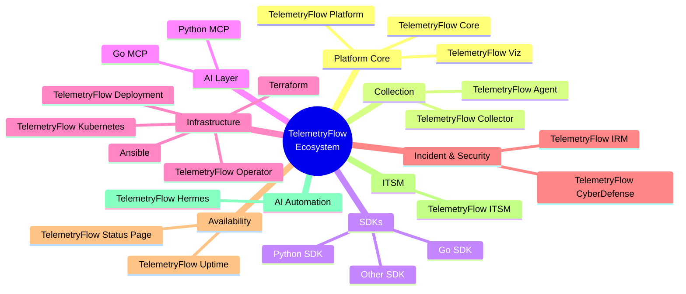
```mermaid
mindmap
  root((TelemetryFlow<br/>Ecosystem))
    Platform Core
      TelemetryFlow Platform
      TelemetryFlow Core
      TelemetryFlow Viz
    Collection
      TelemetryFlow Agent
      TelemetryFlow Collector
    SDKs
      Go SDK
      Python SDK
      Other SDK
    AI Layer
      Go MCP
      Python MCP
    Infrastructure
      TelemetryFlow Deployment
      TelemetryFlow Kubernetes
      TelemetryFlow Operator
      Ansible
      Terraform
    Incident & Security
      TelemetryFlow IRM
      TelemetryFlow CyberDefense
    Availability
      TelemetryFlow Uptime
      TelemetryFlow Status Page
    ITSM
      TelemetryFlow ITSM
    AI Automation
      TelemetryFlow Hermes
```

### Ecosystem Map

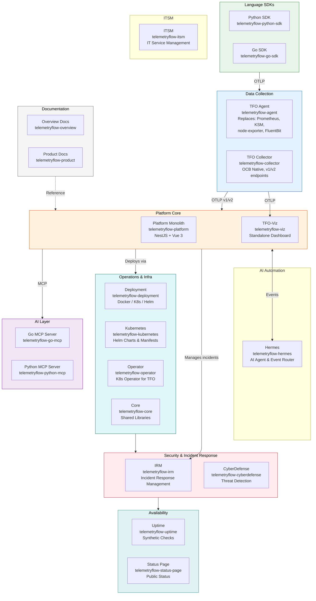
```mermaid
graph TB
    subgraph SDKs["Language SDKs"]
        PYSDK["Python SDK<br/>telemetryflow-python-sdk"]
        GOSDK["Go SDK<br/>telemetryflow-go-sdk"]
    end

    subgraph Collection["Data Collection"]
        AGENT["TFO Agent<br/>telemetryflow-agent<br/>Replaces: Prometheus, KSM,<br/>node-exporter, FluentBit"]
        COLLECTOR["TFO Collector<br/>telemetryflow-collector<br/>OCB Native, v1/v2 endpoints"]
    end

    subgraph Platform["Platform Core"]
        MONO["Platform Monolith<br/>telemetryflow-platform<br/>NestJS + Vue 3"]
        VIZ["TFO-Viz<br/>telemetryflow-viz<br/>Standalone Dashboard"]
    end

    subgraph AI["AI Layer"]
        GOMCP["Go MCP Server<br/>telemetryflow-go-mcp"]
        PYMCP["Python MCP Server<br/>telemetryflow-python-mcp"]
    end

    subgraph Ops["Operations & Infra"]
        DEPLOY["Deployment<br/>telemetryflow-deployment<br/>Docker / K8s / Helm"]
        K8S["Kubernetes<br/>telemetryflow-kubernetes<br/>Helm Charts & Manifests"]
        OPERATOR["Operator<br/>telemetryflow-operator<br/>K8s Operator for TFO"]
        CORE["Core<br/>telemetryflow-core<br/>Shared Libraries"]
    end

    subgraph Security["Security & Incident Response"]
        IRM["IRM<br/>telemetryflow-irm<br/>Incident Response Management"]
        CYBER["CyberDefense<br/>telemetryflow-cyberdefense<br/>Threat Detection"]
    end

    subgraph Avail["Availability"]
        UPTIME["Uptime<br/>telemetryflow-uptime<br/>Synthetic Checks"]
        STPAGE["Status Page<br/>telemetryflow-status-page<br/>Public Status"]
    end

    subgraph AIAuto["AI Automation"]
        HERMES["Hermes<br/>telemetryflow-hermes<br/>AI Agent & Event Router"]
    end

    subgraph ITSMG["ITSM"]
        ITSM["ITSM<br/>telemetryflow-itsm<br/>IT Service Management"]
    end

    subgraph Docs["Documentation"]
        OVERVIEW["Overview Docs<br/>telemetryflow-overview"]
        PRODUCT["Product Docs<br/>telemetryflow-product"]
    end

    SDKs -->|"OTLP"| Collection
    Collection -->|"OTLP v1/v2"| Platform
    Collection -->|"OTLP"| VIZ
    Platform -->|"MCP"| AI
    Platform -->|"Deploys via"| Ops
    Platform -->|"Manages incidents"| IRM
    Platform <-->|"Events"| HERMES
    Ops --> Security
    Security --> Avail
    Docs -.->|"Reference"| Platform

    style SDKs fill:#e8f5e9,stroke:#2e7d32,color:#000
    style Collection fill:#e3f2fd,stroke:#1565c0,color:#000
    style Platform fill:#fff3e0,stroke:#e65100,color:#000
    style AI fill:#f3e5f5,stroke:#6a1b9a,color:#000
    style Ops fill:#e0f7fa,stroke:#00695c,color:#000
    style Security fill:#ffebee,stroke:#c62828,color:#000
    style Avail fill:#e0f2f1,stroke:#0d9488,color:#000
    style Docs fill:#f5f5f5,stroke:#616161,color:#000
```

### Product Icons

<table>
  <tr>
    <td align="center" width="33%">
      <a href="https://github.com/telemetryflow/telemetryflow-platform">
        <picture>
          <source media="(prefers-color-scheme: dark)" srcset="https://github.com/telemetryflow/.github/raw/main/docs/assets/tfo-logo-platform-dark.svg">
          
        </picture>
      </a>
    </td>
    <td align="center" width="33%">
      <a href="https://github.com/telemetryflow/telemetryflow-viz">
        <picture>
          <source media="(prefers-color-scheme: dark)" srcset="https://github.com/telemetryflow/.github/raw/main/docs/assets/tfo-logo-viz-dark.svg">
          
        </picture>
      </a>
    </td>
    <td align="center" width="33%">
      <a href="https://github.com/telemetryflow/telemetryflow-core">
        <picture>
          <source media="(prefers-color-scheme: dark)" srcset="https://github.com/telemetryflow/.github/raw/main/docs/assets/tfo-logo-core-dark.svg">
          
        </picture>
      </a>
    </td>
  </tr>
  <tr>
    <td align="center" width="33%">
      <a href="https://github.com/telemetryflow/telemetryflow-agent">
        <picture>
          <source media="(prefers-color-scheme: dark)" srcset="https://github.com/telemetryflow/.github/raw/main/docs/assets/tfo-logo-agent-dark.svg">
          
        </picture>
      </a>
    </td>
    <td align="center" width="33%">
      <a href="https://github.com/telemetryflow/telemetryflow-collector">
        <picture>
          <source media="(prefers-color-scheme: dark)" srcset="https://github.com/telemetryflow/.github/raw/main/docs/assets/tfo-logo-collector-dark.svg">
          
        </picture>
      </a>
    </td>
    <td align="center" width="33%">
      <a href="https://github.com/telemetryflow/telemetryflow-go-sdk">
        <picture>
          <source media="(prefers-color-scheme: dark)" srcset="https://github.com/telemetryflow/.github/raw/main/docs/assets/tfo-logo-sdk-dark.svg">
          
        </picture>
      </a>
    </td>
  </tr>
  <tr>
    <td align="center" width="33%">
      <a href="https://github.com/telemetryflow/telemetryflow-go-mcp">
        <picture>
          <source media="(prefers-color-scheme: dark)" srcset="https://github.com/telemetryflow/.github/raw/main/docs/assets/tfo-logo-mcp-dark.svg">
          
        </picture>
      </a>
    </td>
    <td align="center" width="33%">
      <a href="https://github.com/telemetryflow/telemetryflow-uptime">
        <picture>
          <source media="(prefers-color-scheme: dark)" srcset="https://github.com/telemetryflow/.github/raw/main/docs/assets/tfo-logo-uptime-dark.svg">
          
        </picture>
      </a>
    </td>
    <td align="center" width="33%">
      <a href="https://github.com/telemetryflow/telemetryflow-kubernetes">
        <picture>
          <source media="(prefers-color-scheme: dark)" srcset="https://github.com/telemetryflow/.github/raw/main/docs/assets/tfo-logo-k8s-dark.svg">
          
        </picture>
      </a>
    </td>
  </tr>
  <tr>
    <td align="center" width="33%">
      <a href="https://github.com/telemetryflow/telemetryflow-deployment">
        <picture>
          <source media="(prefers-color-scheme: dark)" srcset="https://github.com/telemetryflow/.github/raw/main/docs/assets/tfo-logo-deployment-dark.svg">
          
        </picture>
      </a>
    </td>
    <td align="center" width="33%">
      <a href="https://github.com/telemetryflow/telemetryflow-hermes">
        <picture>
          <source media="(prefers-color-scheme: dark)" srcset="https://github.com/telemetryflow/.github/raw/main/docs/assets/tfo-logo-hermes-dark.svg">
          
        </picture>
      </a>
    </td>
    <td align="center" width="33%">
      <a href="https://github.com/telemetryflow/telemetryflow-cyberdefense">
        <picture>
          <source media="(prefers-color-scheme: dark)" srcset="https://github.com/telemetryflow/.github/raw/main/docs/assets/tfo-logo-cyberdefense-dark.svg">
          
        </picture>
      </a>
    </td>
  </tr>
  <tr>
    <td align="center" width="33%">
      <a href="https://github.com/telemetryflow/telemetryflow-irm">
        <picture>
          <source media="(prefers-color-scheme: dark)" srcset="https://github.com/telemetryflow/.github/raw/main/docs/assets/tfo-logo-irm-dark.svg">
          
        </picture>
      </a>
    </td>
    <td align="center" width="33%">
      <a href="https://github.com/telemetryflow/telemetryflow-operator">
        <picture>
          <source media="(prefers-color-scheme: dark)" srcset="https://github.com/telemetryflow/.github/raw/main/docs/assets/tfo-logo-operator-dark.svg">
          
        </picture>
      </a>
    </td>
    <td align="center" width="33%">
      <a href="https://github.com/telemetryflow/telemetryflow-deployment">
        <picture>
          <source media="(prefers-color-scheme: dark)" srcset="https://github.com/telemetryflow/.github/raw/main/docs/assets/tfo-logo-deployment-dark.svg">
          
        </picture>
      </a>
    </td>
  </tr>
  <tr>
    <td align="center" width="33%">
      <a href="https://github.com/telemetryflow/telemetryflow-itsm">
        <picture>
          <source media="(prefers-color-scheme: dark)" srcset="https://github.com/telemetryflow/.github/raw/main/docs/assets/tfo-logo-itsm-dark.svg">
          
        </picture>
      </a>
    </td>
    <td align="center" width="33%"></td>
    <td align="center" width="33%"></td>
  </tr>
</table>

### Ecosystem Components

| Repository                        | Language                    | Description                                                                  |
| --------------------------------- | --------------------------- | ---------------------------------------------------------------------------- |
| **telemetryflow-platform**        | TypeScript (NestJS + Vue 3) | Core platform — backend API, frontend dashboard, dual database               |
| **telemetryflow-agent**           | Go 1.26                     | Infrastructure agent — replaces Prometheus, KSM, node-exporter, FluentBit    |
| **telemetryflow-collector**       | Go 1.26                     | OCB-native OTLP collector with TFO custom components                         |
| **telemetryflow-python-sdk**      | Python 3.12+                | Python SDK for instrumenting applications                                    |
| **telemetryflow-go-sdk**          | Go 1.26+                    | Go SDK for instrumenting applications                                        |
| **telemetryflow-viz**             | TypeScript (Vue 3)          | Standalone observability visualization dashboard                             |
| **telemetryflow-go-mcp**          | Go                          | Go MCP server for Claude AI integration                                      |
| **telemetryflow-python-mcp**      | Python                      | Python MCP server for Claude AI integration                                  |
| **telemetryflow-core**            | Go / TypeScript             | Shared libraries, types, and utilities used across the ecosystem            |
| **telemetryflow-operator**        | Go (controller-runtime)     | Kubernetes Operator for managing TFO Platform lifecycle (CRDs, reconcile)    |
| **telemetryflow-uptime**          | TypeScript (Vue 3)          | Synthetic checks and external endpoint availability monitoring              |
| **telemetryflow-kubernetes**      | YAML / Helm                 | Kubernetes Helm charts and manifests for deploying the full stack            |
| **telemetryflow-deployment**      | Docker / Terraform / Ansible| Deployment automation — Docker Compose, K8s, infrastructure-as-code          |
| **telemetryflow-hermes**          | Go                          | Event & alert message router — fan-out telemetry events to downstream channels |
| **telemetryflow-irm**             | TypeScript (NestJS + Vue 3) | Incident Response Management — on-call, runbooks, postmortems, escalation    |
| **telemetryflow-itsm**            | TypeScript (NestJS + Vue 3) | IT Service Management — ticketing, change, problem, asset, service catalog   |
| **telemetryflow-cyberdefense**    | Go / TypeScript             | Threat detection and security analytics layered on telemetry signals        |
| **telemetryflow-overview**        | Markdown                    | Comprehensive platform documentation                                         |
| **telemetryflow-product**         | Markdown                    | Product summary and features documentation                                   |

---

## High-Level Architecture

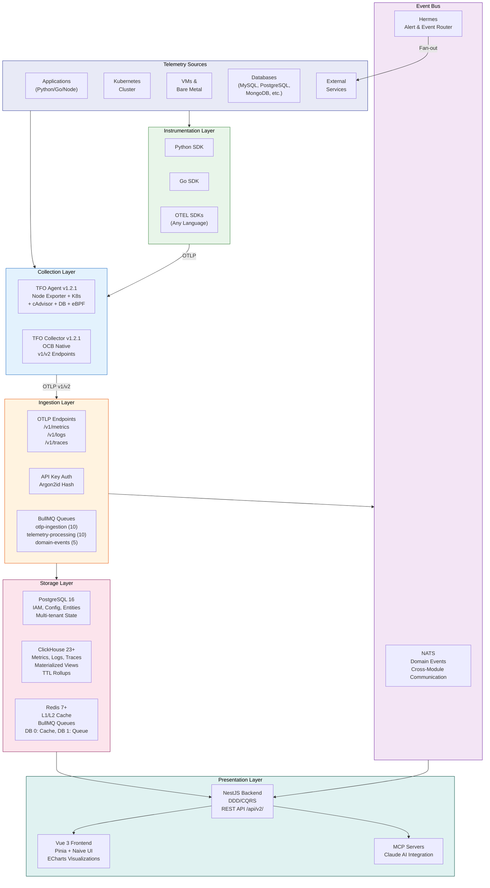
```mermaid
flowchart TB
    subgraph Sources["Telemetry Sources"]
        APP1["Applications<br/>(Python/Go/Node)"]
        K8S["Kubernetes<br/>Cluster"]
        VM["VMs &<br/>Bare Metal"]
        DB["Databases<br/>(MySQL, PostgreSQL,<br/>MongoDB, etc.)"]
        EXT["External<br/>Services"]
    end

    subgraph SDKs["Instrumentation Layer"]
        PSDK["Python SDK"]
        GSDK["Go SDK"]
        OTEL["OTEL SDKs<br/>(Any Language)"]
    end

    subgraph Collection["Collection Layer"]
        AGENT["TFO Agent v1.2.1<br/>Node Exporter + K8s<br/>+ cAdvisor + DB + eBPF"]
        TFOC["TFO Collector v1.2.1<br/>OCB Native<br/>v1/v2 Endpoints"]
    end

    subgraph Ingestion["Ingestion Layer"]
        OTLP_EP["OTLP Endpoints<br/>/v1/metrics<br/>/v1/logs<br/>/v1/traces"]
        AUTH["API Key Auth<br/>Argon2id Hash"]
        QUEUE["BullMQ Queues<br/>otlp-ingestion (10)<br/>telemetry-processing (10)<br/>domain-events (5)"]
    end

    subgraph Storage["Storage Layer"]
        PG["PostgreSQL 16<br/>IAM, Config, Entities<br/>Multi-tenant State"]
        CH["ClickHouse 23+<br/>Metrics, Logs, Traces<br/>Materialized Views<br/>TTL Rollups"]
        RD["Redis 7+<br/>L1/L2 Cache<br/>BullMQ Queues<br/>DB 0: Cache, DB 1: Queue"]
    end

    subgraph Messaging["Event Bus"]
        NATS["NATS<br/>Domain Events<br/>Cross-Module Communication"]
        HERMES["Hermes<br/>Alert & Event Router"]
    end

    subgraph Presentation["Presentation Layer"]
        BE["NestJS Backend<br/>DDD/CQRS<br/>REST API /api/v2/"]
        FE["Vue 3 Frontend<br/>Pinia + Naive UI<br/>ECharts Visualizations"]
        MCP["MCP Servers<br/>Claude AI Integration"]
    end

    Sources --> SDKs
    Sources --> Collection
    SDKs -->|"OTLP"| Collection
    Collection -->|"OTLP v1/v2"| Ingestion
    Ingestion --> Storage
    Ingestion --> Messaging
    Storage --> BE
    Messaging --> BE
    BE --> FE
    BE --> MCP
    HERMES -->|"Fan-out"| EXT

    style Sources fill:#e8eaf6,stroke:#283593,color:#000
    style SDKs fill:#e8f5e9,stroke:#2e7d32,color:#000
    style Collection fill:#e3f2fd,stroke:#1565c0,color:#000
    style Ingestion fill:#fff3e0,stroke:#e65100,color:#000
    style Storage fill:#fce4ec,stroke:#880e4f,color:#000
    style Messaging fill:#f3e5f5,stroke:#6a1b9a,color:#000
    style Presentation fill:#e0f2f1,stroke:#004d40,color:#000
```

---

## Platform Capabilities

### Backend Modules (DDD/CQRS Architecture)

The platform backend follows **Domain-Driven Design** with strict layer separation — Domain, Application, Infrastructure, and Presentation:

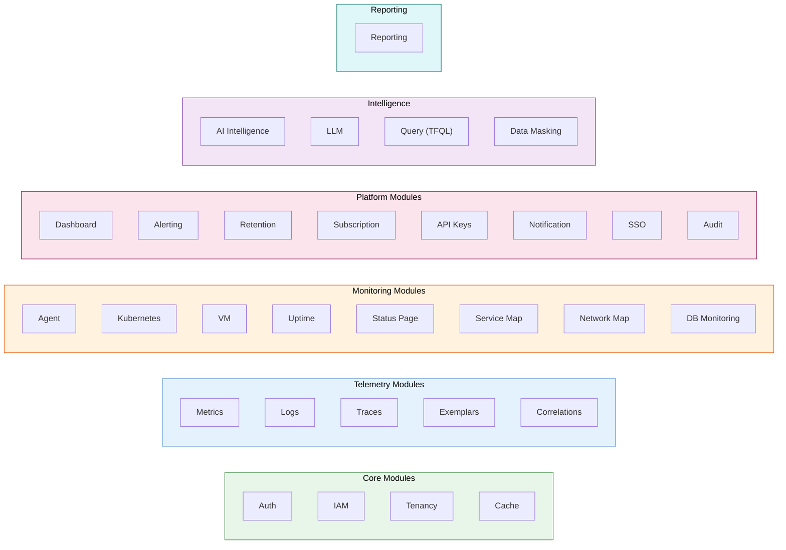
```mermaid
graph LR
    subgraph Core["Core Modules"]
        AUTH["Auth"]
        IAM["IAM"]
        TEN["Tenancy"]
        CACHE["Cache"]
    end

    subgraph Telemetry["Telemetry Modules"]
        MET["Metrics"]
        LOGS["Logs"]
        TRC["Traces"]
        EXM["Exemplars"]
        COR["Correlations"]
    end

    subgraph Monitoring["Monitoring Modules"]
        AGT["Agent"]
        K8S["Kubernetes"]
        VM_M["VM"]
        UPT["Uptime"]
        STP["Status Page"]
        SVM["Service Map"]
        NWM["Network Map"]
        DBM["DB Monitoring"]
    end

    subgraph Platform["Platform Modules"]
        DSH["Dashboard"]
        ALR["Alerting"]
        RET["Retention"]
        SUB["Subscription"]
        APK["API Keys"]
        NOT["Notification"]
        SSO["SSO"]
        AUD["Audit"]
    end

    subgraph Intelligence["Intelligence"]
        AI["AI Intelligence"]
        LLM["LLM"]
        QRY["Query (TFQL)"]
        DM["Data Masking"]
    end

    subgraph Reporting["Reporting"]
        RPT["Reporting"]
    end

    style Core fill:#e8f5e9,stroke:#2e7d32,color:#000
    style Telemetry fill:#e3f2fd,stroke:#1565c0,color:#000
    style Monitoring fill:#fff3e0,stroke:#e65100,color:#000
    style Platform fill:#fce4ec,stroke:#880e4f,color:#000
    style Intelligence fill:#f3e5f5,stroke:#6a1b9a,color:#000
    style Reporting fill:#e0f7fa,stroke:#00695c,color:#000
```

### Monitoring Modules (25+ Backend Modules)

| Category         | Modules                                                                             |
| ---------------- | ----------------------------------------------------------------------------------- |
| **Core**         | Auth, IAM, Tenancy, Cache                                                           |
| **Telemetry**    | Metrics, Logs, Traces, Exemplars, Correlations                                      |
| **Monitoring**   | Agent, Kubernetes, VM, Uptime, Status Page, Service Map, Network Map, DB Monitoring |
| **Platform**     | Dashboard, Alerting, Retention, Subscription, API Keys, Notification, SSO, Audit    |
| **Intelligence** | AI Intelligence, LLM, Query (TFQL), Data Masking                                    |
| **Reporting**    | Reporting                                                                           |

### DDD Module Layer Structure

Each module follows the same internal architecture:

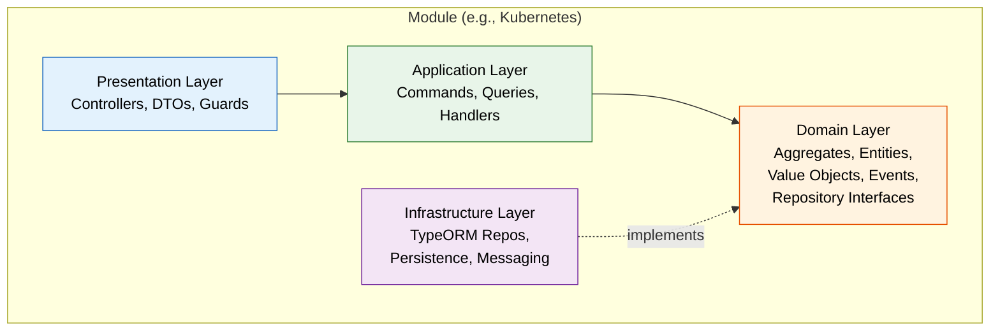
```mermaid
graph TB
    subgraph Module["Module (e.g., Kubernetes)"]
        PRE["Presentation Layer<br/>Controllers, DTOs, Guards"]
        APP["Application Layer<br/>Commands, Queries, Handlers"]
        DOM["Domain Layer<br/>Aggregates, Entities,<br/>Value Objects, Events,<br/>Repository Interfaces"]
        INF["Infrastructure Layer<br/>TypeORM Repos,<br/>Persistence, Messaging"]
    end

    PRE --> APP
    APP --> DOM
    INF -.->|"implements"| DOM

    style PRE fill:#e3f2fd,stroke:#1565c0,color:#000
    style APP fill:#e8f5e9,stroke:#2e7d32,color:#000
    style DOM fill:#fff3e0,stroke:#e65100,color:#000
    style INF fill:#f3e5f5,stroke:#6a1b9a,color:#000
```

---

## Telemetry Signals

### Unified OTLP Ingestion

All telemetry signals flow through a unified OTLP ingestion pipeline:

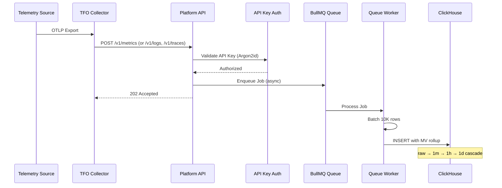
```mermaid
sequenceDiagram
    participant SRC as Telemetry Source
    participant COL as TFO Collector
    participant API as Platform API
    participant AUTH as API Key Auth
    participant Q as BullMQ Queue
    participant W as Queue Worker
    participant CH as ClickHouse

    SRC->>COL: OTLP Export
    COL->>API: POST /v1/metrics (or /v1/logs, /v1/traces)
    API->>AUTH: Validate API Key (Argon2id)
    AUTH-->>API: Authorized
    API->>Q: Enqueue Job (async)
    API-->>COL: 202 Accepted
    Q->>W: Process Job
    W->>W: Batch 10K rows
    W->>CH: INSERT with MV rollup
    Note over CH: raw → 1m → 1h → 1d cascade
```

### Metrics

- **Storage**: ClickHouse time-series with pre-aggregation materialized views
- **Types**: Gauges, Counters, Histograms, Summaries
- **Aggregation**: sum, avg, min, max, percentiles (p50, p90, p95, p99)
- **Rollup Cascade**: raw → 1m → 1h → 1d (automatic via materialized views)
- **Exemplars**: Metric-to-trace correlation for contextual debugging

### Logs

- **Structured logging** with full-text search across all attributes
- **Severity levels**: DEBUG, INFO, WARN, ERROR, FATAL
- **Trace context** propagation (traceId, spanId linking)
- **Real-time streaming** via WebSocket
- **High-cardinality** attribute indexing

### Traces

- **Distributed tracing** with waterfall span visualization
- **Service dependency** mapping from span relationships
- **Critical path analysis** identifying bottlenecks
- **Trace-log correlation** for unified debugging
- **Span attribute search** with flexible filtering

### Correlations & Exemplars

- **Correlations**: Links traces → logs → metrics for unified incident investigation
- **Exemplars**: Attach exemplar trace IDs to metric data points for contextual drill-down
- **TTL**: 7d (exemplars) → 30d (logs/traces) → 90d (metrics/audit/uptime)

---

## Infrastructure Monitoring

### TFO Agent v1.2.1 — One-For-All Collector

The TFO Agent is a Go-based agent that replaces multiple traditional monitoring tools:

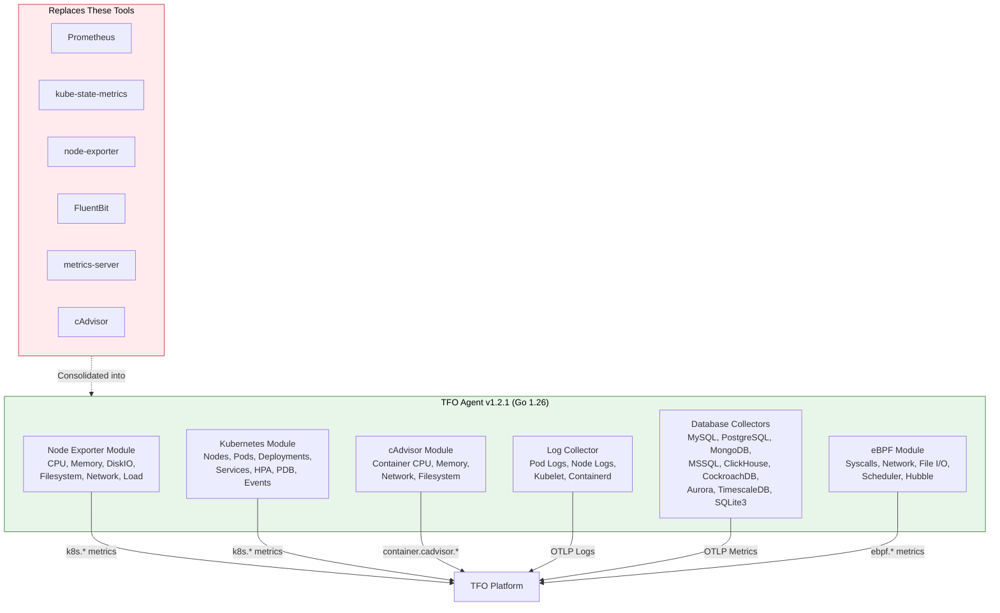
```mermaid
graph TB
    subgraph Replaced["Replaces These Tools"]
        PROM["Prometheus"]
        KSM["kube-state-metrics"]
        NE["node-exporter"]
        FB["FluentBit"]
        MS["metrics-server"]
        CAD["cAdvisor"]
    end

    subgraph Agent["TFO Agent v1.2.1 (Go 1.26)"]
        NE_MOD["Node Exporter Module<br/>CPU, Memory, DiskIO,<br/>Filesystem, Network, Load"]
        K8S_MOD["Kubernetes Module<br/>Nodes, Pods, Deployments,<br/>Services, HPA, PDB, Events"]
        CAD_MOD["cAdvisor Module<br/>Container CPU, Memory,<br/>Network, Filesystem"]
        LOG_MOD["Log Collector<br/>Pod Logs, Node Logs,<br/>Kubelet, Containerd"]
        DB_MOD["Database Collectors<br/>MySQL, PostgreSQL, MongoDB,<br/>MSSQL, ClickHouse, CockroachDB,<br/>Aurora, TimescaleDB, SQLite3"]
        EBPF_MOD["eBPF Module<br/>Syscalls, Network, File I/O,<br/>Scheduler, Hubble"]
    end

    Replaced -.->|"Consolidated into"| Agent
    NE_MOD -->|"k8s.* metrics"| PLATFORM["TFO Platform"]
    K8S_MOD -->|"k8s.* metrics"| PLATFORM
    CAD_MOD -->|"container.cadvisor.*"| PLATFORM
    LOG_MOD -->|"OTLP Logs"| PLATFORM
    DB_MOD -->|"OTLP Metrics"| PLATFORM
    EBPF_MOD -->|"ebpf.* metrics"| PLATFORM

    style Replaced fill:#ffebee,stroke:#c62828,color:#000
    style Agent fill:#e8f5e9,stroke:#2e7d32,color:#000
```

**Key Capabilities:**

- 9 database collectors (MySQL, PostgreSQL, MongoDB, MSSQL, ClickHouse, CockroachDB, Aurora, TimescaleDB, SQLite3)
- 28 eBPF kernel-level metrics across 7 categories
- 39+ third-party integrations (Cloud, APM, OSS Observability, Streaming, Network)
- Docker container monitoring (32 per-container metrics)
- Disk-backed buffer for offline resilience
- Cross-platform: Linux, macOS, Windows

### TFO Collector v1.2.1 — OCB-Native Gateway

Enterprise-grade OTLP collector built on **OpenTelemetry Collector Builder (OCB)** with 85+ community components and 4 custom TFO components:

| Component     | Type      | Description                                            |
| ------------- | --------- | ------------------------------------------------------ |
| `tfootlp`     | Receiver  | OTLP receiver with v1/v2 dual endpoint support         |
| `tfo`         | Exporter  | Platform exporter with automatic auth header injection |
| `tfoauth`     | Extension | API key management for TFO authentication              |
| `tfoidentity` | Extension | Collector identity and resource enrichment             |

**Pipeline Architecture:**

- **Traces**: tfootlp → k8sattributes → batch → tfo + spanmetrics + servicegraph
- **Metrics**: tfootlp → k8sattributes → transform → batch → tfo + prometheus
- **Logs**: tfootlp → k8sattributes → batch → tfo

### Kubernetes Monitoring

Comprehensive K8s observability with 79+ graph definitions and 8 datatables:

| Category          | Metrics                               | Graphs |
| ----------------- | ------------------------------------- | ------ |
| **Node Metrics**  | CPU, Memory, Disk, Network, Load      | 15+    |
| **Pod/Container** | CPU, Memory, Restarts, Status         | 20+    |
| **Workloads**     | Deployments, StatefulSets, DaemonSets | 12+    |
| **Storage**       | PV, PVC, Storage Classes              | 8+     |
| **Network**       | Services, Endpoints, Ingresses        | 10+    |
| **Cluster**       | API Server, CoreDNS, Events, HPA      | 14+    |

### VM Monitoring

Infrastructure monitoring for virtual machines and bare-metal servers with agent-based collection.

### Uptime Monitoring

Synthetic checks and endpoint monitoring for external service availability tracking — powered by **[TelemetryFlow Uptime](https://github.com/telemetryflow/telemetryflow-uptime)**.

### eBPF Metrics (Linux-only)

The eBPF collector provides 28 kernel-level metrics across 7 categories:

- **Syscall**: count, latency, errors (with pid, comm, syscall labels)
- **Network**: TCP connections, bytes, RTT, retransmits; UDP packets
- **File I/O**: operations, bytes, latency
- **Scheduler**: context switches, runq latency, oncpu, migrations
- **Memory**: page faults (major/minor)
- **TCP State**: state transitions tracking
- **Hubble**: flows, drops, policy verdicts, HTTP requests, DNS queries

### 3rd Party Integrations (39+)

| Category              | Integrations                                                 | Count |
| --------------------- | ------------------------------------------------------------ | ----- |
| **Cloud Providers**   | GCP, Azure, Alibaba Cloud, AWS CloudWatch                    | 4     |
| **Infrastructure**    | Proxmox, VMware vSphere, Nutanix, Azure Arc                  | 4     |
| **Network & IoT**     | Cisco (DNA Center/Meraki), SNMP v1/v2c/v3, MQTT              | 3     |
| **Kernel/System**     | eBPF (syscalls, network, file I/O, scheduler), Cilium Hubble | 2     |
| **APM Platforms**     | Dynatrace, IBM Instana, Datadog, New Relic                   | 4     |
| **OSS Observability** | SigNoz, Coroot, HyperDX, OpenObserve, Netdata                | 5     |
| **Observability**     | Prometheus, Splunk, Elasticsearch                            | 3     |
| **Streaming & Logs**  | Kafka, Loki, InfluxDB                                        | 3     |
| **Tracing**           | Jaeger, Zipkin                                               | 2     |
| **Monitoring Tools**  | Telegraf, Grafana Alloy, Percona PMM, Blackbox, ManageEngine | 5     |
| **Custom**            | Webhook                                                      | 1     |

---

## Database Monitoring

Comprehensive database performance monitoring with native collectors for popular databases:

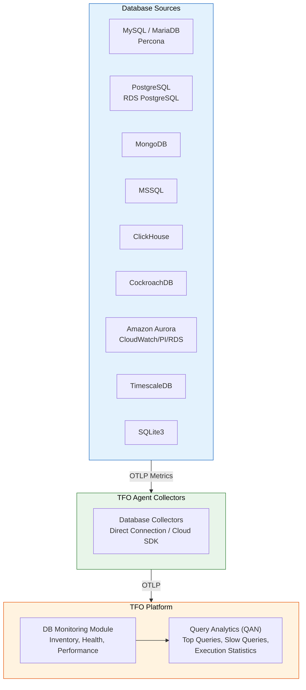
```mermaid
graph TB
    subgraph Databases["Database Sources"]
        MYSQL["MySQL / MariaDB<br/>Percona"]
        PG["PostgreSQL<br/>RDS PostgreSQL"]
        MONGO["MongoDB"]
        MSSQL["MSSQL"]
        CH["ClickHouse"]
        CRDB["CockroachDB"]
        AURORA["Amazon Aurora<br/>CloudWatch/PI/RDS"]
        TSCALE["TimescaleDB"]
        SQLITE["SQLite3"]
    end

    subgraph Agent["TFO Agent Collectors"]
        COLL["Database Collectors<br/>Direct Connection / Cloud SDK"]
    end

    subgraph Platform["TFO Platform"]
        DBMON["DB Monitoring Module<br/>Inventory, Health, Performance"]
        QAN["Query Analytics (QAN)<br/>Top Queries, Slow Queries,<br/>Execution Statistics"]
    end

    Databases -->|"OTLP Metrics"| Agent
    Agent -->|"OTLP"| Platform
    DBMON --> QAN

    style Databases fill:#e3f2fd,stroke:#1565c0,color:#000
    style Agent fill:#e8f5e9,stroke:#2e7d32,color:#000
    style Platform fill:#fff3e0,stroke:#e65100,color:#000
```

### Supported Databases

| Collector         | Source                        | Metrics                                                                               |
| ----------------- | ----------------------------- | ------------------------------------------------------------------------------------- |
| **Amazon Aurora** | AWS SDK (CloudWatch, RDS, PI) | 60+ CloudWatch metrics across storage, replication, cache, latency, transactions      |
| **MySQL/MariaDB** | Direct connection             | Global status, InnoDB, replication, Galera, query analytics, Percona                  |
| **PostgreSQL**    | Direct connection             | pg_stat_activity, pg_stat_database, pg_stat_bgwriter, pg_stat_statements, replication |
| **MSSQL**         | Direct connection             | Wait stats, perf counters, index usage, tempdb, agent jobs, query store               |
| **MongoDB**       | Direct connection             | Server status, replica set, sharding, query profiler, collection stats                |
| **ClickHouse**    | HTTP API                      | System tables, query metrics, merge stats, replication queue                          |
| **CockroachDB**   | Direct connection             | SQL stats, range stats, store metrics, replication                                    |
| **TimescaleDB**   | Direct connection             | Hypertable stats, chunk stats, compression ratios, continuous aggregates              |
| **SQLite3**       | File access                   | Page cache, WAL metrics, lock contention, integrity checks                            |

---

## Enterprise Features

### Multi-Tenancy

Hierarchical isolation model with automatic data segregation:

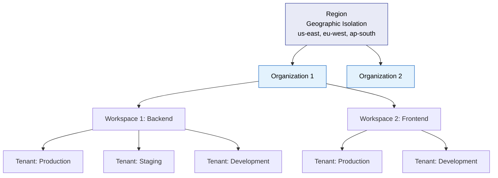
```mermaid
graph TD
    REGION["Region<br/>Geographic Isolation<br/>us-east, eu-west, ap-south"]

    REGION --> ORG1["Organization 1"]
    REGION --> ORG2["Organization 2"]

    ORG1 --> WS1["Workspace 1: Backend"]
    ORG1 --> WS2["Workspace 2: Frontend"]

    WS1 --> T1["Tenant: Production"]
    WS1 --> T2["Tenant: Staging"]
    WS1 --> T3["Tenant: Development"]

    WS2 --> T4["Tenant: Production"]
    WS2 --> T5["Tenant: Development"]

    style REGION fill:#e8eaf6,stroke:#283593,color:#000
    style ORG1 fill:#e3f2fd,stroke:#1565c0,color:#000
    style ORG2 fill:#e3f2fd,stroke:#1565c0,color:#000
```

### Security (5-Tier RBAC)

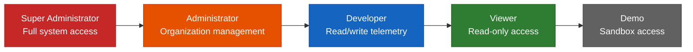
```mermaid
graph LR
    SA["Super Administrator<br/>Full system access"]
    ADM["Administrator<br/>Organization management"]
    DEV["Developer<br/>Read/write telemetry"]
    VWR["Viewer<br/>Read-only access"]
    DEMO["Demo<br/>Sandbox access"]

    SA --> ADM --> DEV --> VWR --> DEMO

    style SA fill:#c62828,stroke:#b71c1c,color:#fff
    style ADM fill:#e65100,stroke:#bf360c,color:#fff
    style DEV fill:#1565c0,stroke:#0d47a1,color:#fff
    style VWR fill:#2e7d32,stroke:#1b5e20,color:#fff
    style DEMO fill:#616161,stroke:#424242,color:#fff
```

- **Authentication**: JWT, MFA, SSO (Google, GitHub, Azure AD, Okta)
- **Authorization**: Role-based access control with 5 tiers
- **API Keys**: Argon2id-hashed keys with scope and tenant binding
- **Audit Logging**: Immutable time-series audit trail in ClickHouse
- **Data Masking**: PII redaction policies for sensitive telemetry data
- **CyberDefense**: Threat detection layered on telemetry via **[TelemetryFlow CyberDefense](https://github.com/telemetryflow/telemetryflow-cyberdefense)**

### Alerting

- **33 production-ready alert rules** with fatigue prevention
- **Multi-channel notifications**: Email, Slack, Webhook, PagerDuty
- **Alert fatigue management**: Deduplication, grouping, silencing
- **Severity levels**: Critical, Warning, Info
- **Threshold types**: Static, Anomaly-based
- **Routing**: Fan-out via **[TelemetryFlow Hermes](https://github.com/telemetryflow/telemetryflow-hermes)** event router

### Dashboards

- **6 pre-configured templates** with 12+ widget types
- **Custom dashboards** with drag-and-drop layout
- **Real-time updates** via WebSocket
- **Cross-signal correlation** widgets

### Reporting

- **Scheduled reports** with PDF generation
- **9 API endpoints** at `/api/v2/reports/`
- **Template-based** report generation
- **Email delivery** with customizable schedules

### Retention & Subscription

- **Retention policies**: Per-signal TTL management (7d–90d+)
- **Subscription management**: Plan-based feature gating
- **Data lifecycle**: Automatic rollup and archival

---

## AI Intelligence

### MCP Integration

Model Context Protocol servers enable AI-powered observability:

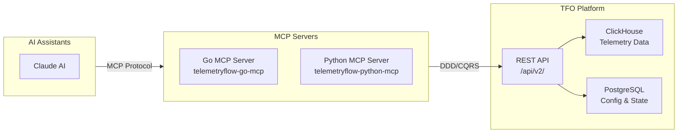
```mermaid
flowchart LR
    subgraph AI["AI Assistants"]
        CLAUDE["Claude AI"]
    end

    subgraph MCPS["MCP Servers"]
        GMCP["Go MCP Server<br/>telemetryflow-go-mcp"]
        PMCP["Python MCP Server<br/>telemetryflow-python-mcp"]
    end

    subgraph Platform["TFO Platform"]
        API["REST API<br/>/api/v2/"]
        CH["ClickHouse<br/>Telemetry Data"]
        PG["PostgreSQL<br/>Config & State"]
    end

    AI -->|"MCP Protocol"| MCPS
    MCPS -->|"DDD/CQRS"| API
    API --> CH
    API --> PG
```

### LLM Module

- **Claude AI integration** for natural language querying
- **TFQL generation** from natural language descriptions
- **Anomaly explanation** with contextual analysis
- **Incident summarization** across correlated signals

### Query Engine (TFQL)

TelemetryFlow Query Language translates to multiple backends:

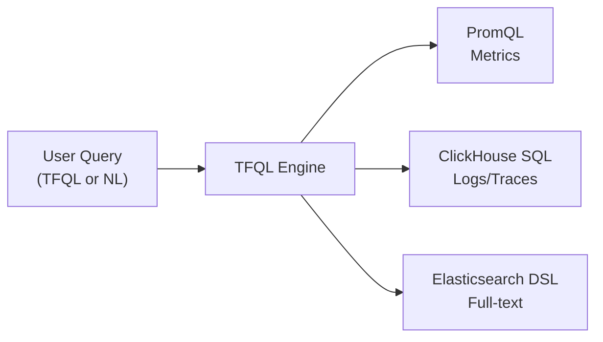
```mermaid
flowchart LR
    USER["User Query<br/>(TFQL or NL)"]
    TFQL["TFQL Engine"]
    PROM["PromQL<br/>Metrics"]
    CHSQL["ClickHouse SQL<br/>Logs/Traces"]
    ES["Elasticsearch DSL<br/>Full-text"]

    USER --> TFQL
    TFQL --> PROM
    TFQL --> CHSQL
    TFQL --> ES
```

---

## Technology Stack

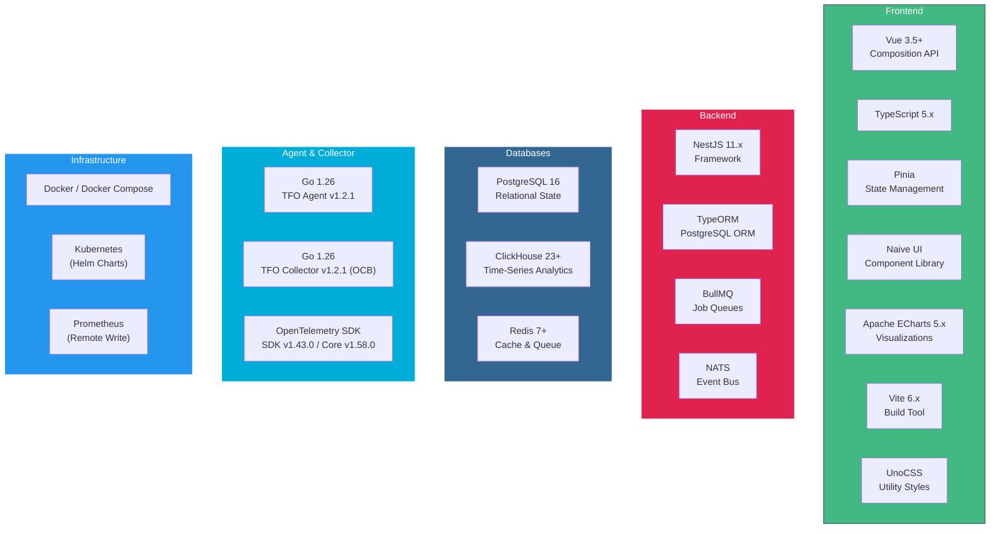
```mermaid
graph TB
    subgraph Frontend["Frontend"]
        VUE["Vue 3.5+<br/>Composition API"]
        TS["TypeScript 5.x"]
        PINIA["Pinia<br/>State Management"]
        NAIVE["Naive UI<br/>Component Library"]
        ECHARTS["Apache ECharts 5.x<br/>Visualizations"]
        VITE["Vite 6.x<br/>Build Tool"]
        UNO["UnoCSS<br/>Utility Styles"]
    end

    subgraph Backend["Backend"]
        NEST["NestJS 11.x<br/>Framework"]
        TYPEORM["TypeORM<br/>PostgreSQL ORM"]
        BULL["BullMQ<br/>Job Queues"]
        NATS_CLIENT["NATS<br/>Event Bus"]
    end

    subgraph Databases["Databases"]
        PG["PostgreSQL 16<br/>Relational State"]
        CLICK["ClickHouse 23+<br/>Time-Series Analytics"]
        REDIS["Redis 7+<br/>Cache & Queue"]
    end

    subgraph Agent["Agent & Collector"]
        GOAGENT["Go 1.26<br/>TFO Agent v1.2.1"]
        GOCOL["Go 1.26<br/>TFO Collector v1.2.1 (OCB)"]
        OTEL_SDK["OpenTelemetry SDK<br/>SDK v1.43.0 / Core v1.58.0"]
    end

    subgraph Infra["Infrastructure"]
        DOCKER["Docker / Docker Compose"]
        K8S_DEPLOY["Kubernetes<br/>(Helm Charts)"]
        PROM_SERVER["Prometheus<br/>(Remote Write)"]
    end

    style Frontend fill:#42b883,stroke:#2c3e50,color:#fff
    style Backend fill:#e0234e,stroke:#fff,color:#fff
    style Databases fill:#336791,stroke:#fff,color:#fff
    style Agent fill:#00add8,stroke:#fff,color:#fff
    style Infra fill:#2496ed,stroke:#fff,color:#fff
```

| Layer                | Technology                | Purpose                                               |
| -------------------- | ------------------------- | ----------------------------------------------------- |
| **Frontend**         | Vue 3 + TypeScript + Vite | SPA dashboard with Pinia stores                       |
| **UI Framework**     | Naive UI + UnoCSS         | Enterprise component library + utility CSS            |
| **Visualization**    | Apache ECharts 5.x        | Time-series, heatmaps, flame graphs, treemaps         |
| **Backend**          | NestJS 11.x               | REST API with DDD/CQRS architecture                   |
| **ORM**              | TypeORM                   | PostgreSQL entity management with migrations          |
| **Relational DB**    | PostgreSQL 16             | IAM, configuration, multi-tenant state                |
| **Time-Series DB**   | ClickHouse 23+            | Metrics, logs, traces with materialized views         |
| **Cache**            | Redis 7+                  | Dual-layer cache (L1 in-memory, L2 Redis) + queues    |
| **Queue**            | BullMQ on Redis DB 1      | Async processing (ingestion, events, alerts, reports) |
| **Messaging**        | NATS                      | Cross-module domain events                            |
| **Agent**            | Go 1.26                   | Infrastructure collection (replaces Prometheus stack) |
| **Collector**        | Go 1.26 (OCB)             | OTLP routing with TFO authentication                  |
| **SDKs**             | Python 3.12+ / Go 1.26+   | Application instrumentation                           |
| **Containerization** | Docker + Docker Compose   | Development and deployment                            |
| **Orchestration**    | Kubernetes + Helm         | Production deployment                                 |

---

## Data Architecture

### Dual Database Design

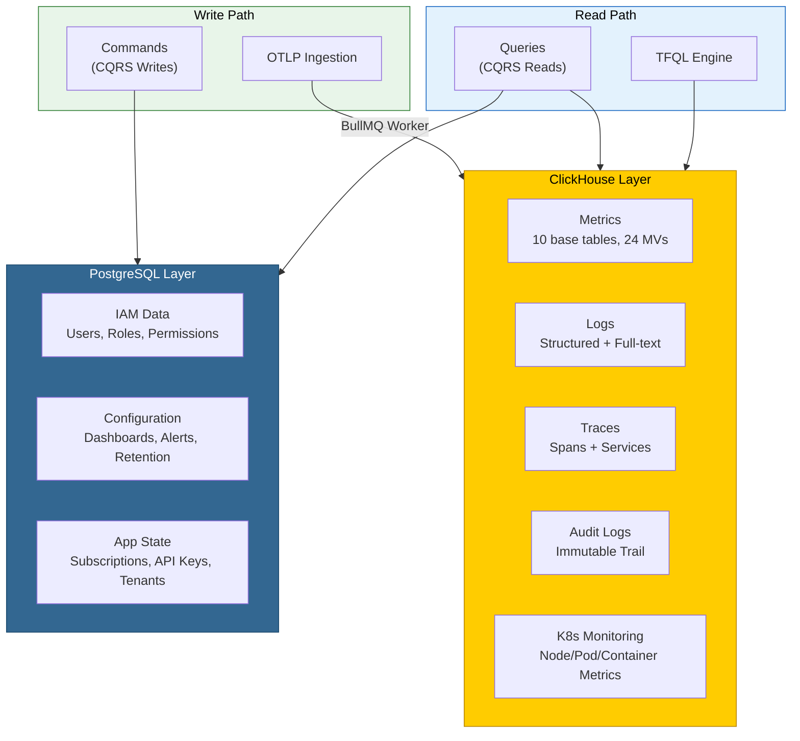
```mermaid
graph TB
    subgraph Write["Write Path"]
        CMD["Commands<br/>(CQRS Writes)"]
        OTLP["OTLP Ingestion"]
    end

    subgraph Read["Read Path"]
        QRY["Queries<br/>(CQRS Reads)"]
        TFQL["TFQL Engine"]
    end

    subgraph PG_Layer["PostgreSQL Layer"]
        IAM["IAM Data<br/>Users, Roles, Permissions"]
        CONFIG["Configuration<br/>Dashboards, Alerts, Retention"]
        STATE["App State<br/>Subscriptions, API Keys, Tenants"]
    end

    subgraph CH_Layer["ClickHouse Layer"]
        METS["Metrics<br/>10 base tables, 24 MVs"]
        LOGS_CH["Logs<br/>Structured + Full-text"]
        TRACES["Traces<br/>Spans + Services"]
        AUDIT["Audit Logs<br/>Immutable Trail"]
        K8S_DATA["K8s Monitoring<br/>Node/Pod/Container Metrics"]
    end

    CMD --> PG_Layer
    OTLP -->|"BullMQ Worker"| CH_Layer
    QRY --> PG_Layer
    QRY --> CH_Layer
    TFQL --> CH_Layer

    style Write fill:#e8f5e9,stroke:#2e7d32,color:#000
    style Read fill:#e3f2fd,stroke:#1565c0,color:#000
    style PG_Layer fill:#336791,stroke:#1a4a6e,color:#fff
    style CH_Layer fill:#ffcc00,stroke:#b8860b,color:#000
```

### ClickHouse Rollup Strategy

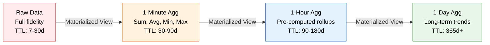
```mermaid
graph LR
    RAW["Raw Data<br/>Full fidelity<br/>TTL: 7-30d"]
    ONE_M["1-Minute Agg<br/>Sum, Avg, Min, Max<br/>TTL: 30-90d"]
    ONE_H["1-Hour Agg<br/>Pre-computed rollups<br/>TTL: 90-180d"]
    ONE_D["1-Day Agg<br/>Long-term trends<br/>TTL: 365d+"]

    RAW -->|"Materialized View"| ONE_M
    ONE_M -->|"Materialized View"| ONE_H
    ONE_H -->|"Materialized View"| ONE_D

    style RAW fill:#ffebee,stroke:#c62828,color:#000
    style ONE_M fill:#fff3e0,stroke:#e65100,color:#000
    style ONE_H fill:#e3f2fd,stroke:#1565c0,color:#000
    style ONE_D fill:#e8f5e9,stroke:#2e7d32,color:#000
```

### Queue System

| Queue                  | Concurrency | Purpose                           |
| ---------------------- | ----------- | --------------------------------- |
| `otlp-ingestion`       | 10          | OTLP telemetry data processing    |
| `telemetry-processing` | 10          | Post-ingestion transformations    |
| `domain-events`        | 5           | Cross-module event propagation    |
| `alerts`               | 5           | Alert evaluation and notification |
| `notifications`        | 3           | Email, Slack, webhook delivery    |
| `reports`              | 3           | Scheduled report generation       |

### Cache Strategy

| Layer          | TTL   | Storage        | Purpose                           |
| -------------- | ----- | -------------- | --------------------------------- |
| L1 — In-Memory | 60s   | Process memory | Hot data, API responses           |
| L2 — Redis     | 1800s | Redis DB 0     | Distributed cache, cross-instance |

Key prefix: `tf:cache:` with event-driven invalidation.

---

## Component Registry System

The frontend uses a centralized registry for all UI components:

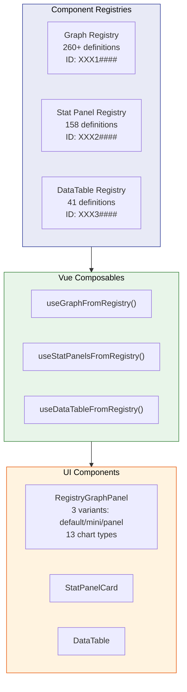
```mermaid
graph TB
    subgraph Registries["Component Registries"]
        GR["Graph Registry<br/>260+ definitions<br/>ID: XXX1####"]
        SP["Stat Panel Registry<br/>158 definitions<br/>ID: XXX2####"]
        DT["DataTable Registry<br/>41 definitions<br/>ID: XXX3####"]
    end

    subgraph Composables["Vue Composables"]
        UGR["useGraphFromRegistry()"]
        USP["useStatPanelsFromRegistry()"]
        UDT["useDataTableFromRegistry()"]
    end

    subgraph Components["UI Components"]
        RGP["RegistryGraphPanel<br/>3 variants: default/mini/panel<br/>13 chart types"]
        SP_COMP["StatPanelCard"]
        DT_COMP["DataTable"]
    end

    Registries --> Composables
    Composables --> Components

    style Registries fill:#e8eaf6,stroke:#283593,color:#000
    style Composables fill:#e8f5e9,stroke:#2e7d32,color:#000
    style Components fill:#fff3e0,stroke:#e65100,color:#000
```

**459 total** registry entries across 23 module codes, rendered by Vue composables → 13 chart types via `RegistryGraphPanel` (3 variants: default/mini/panel).

**23 Module Codes**: HOM, DSH, MET, TRC, LOG, COR, EXP, ALR, RPT, UPT, STP, SVM, NWM, K8S, INF, AGT, RET, SUB, IAM, TEN, AUD, APK, NOT, LLM

**Chart Types**: Line, Area, Bar, Stacked Bar, Heatmap, Pie, Donut, Gauge, Treemap, Flame Graph, Table, Scatter, Text

---

## Deployment

TelemetryFlow ships with multiple deployment paths. The dedicated **[TelemetryFlow Deployment](https://github.com/telemetryflow/telemetryflow-deployment)** repository bundles everything you need — Docker Compose stacks, Kubernetes manifests, Helm charts, and infrastructure-as-code templates.

### TelemetryFlow Deployment Repository

[**github.com/telemetryflow/telemetryflow-deployment**](https://github.com/telemetryflow/telemetryflow-deployment) provides:

- **Docker Compose** — Single-command local/development stacks with profiles (`core`, `monitoring`, `all`)
- **Kubernetes** — Production-grade manifests with persistent volumes, secrets, and ingress
- **Helm Charts** — Parameterized charts for the Platform, Agent, and Collector
- **Infrastructure-as-Code** — Terraform modules for managed PostgreSQL, ClickHouse, and Redis
- **Environment Templates** — `.env.example` files for every deployment topology

> For Kubernetes-native deployment, see also **[TelemetryFlow Kubernetes](https://github.com/telemetryflow/telemetryflow-kubernetes)** for the canonical Helm chart registry and operator configs.

### Docker Compose Profiles

```bash
# Core services (PostgreSQL, ClickHouse, Redis, NATS, Backend, Frontend)
docker-compose --profile core up -d

# Core + Monitoring (TFO Collector, TFO Agent, Jaeger)
docker-compose --profile core --profile monitoring up -d

# Everything
docker-compose --profile all up -d
```

### Infrastructure Services

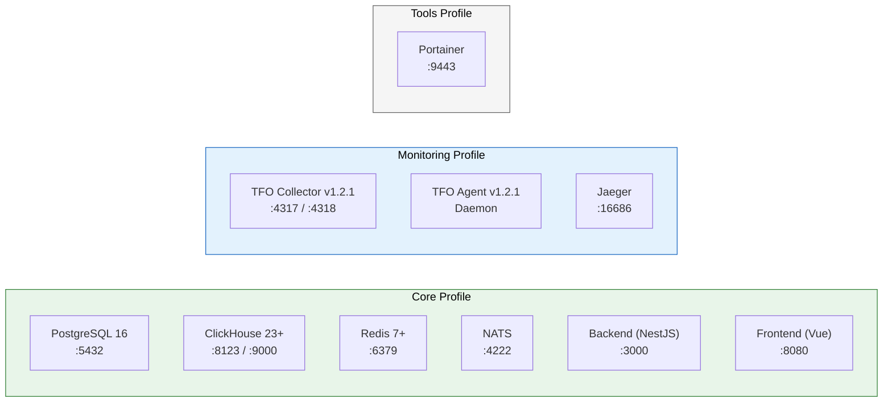
```mermaid
graph LR
    subgraph Core["Core Profile"]
        PG_SVC["PostgreSQL 16<br/>:5432"]
        CH_SVC["ClickHouse 23+<br/>:8123 / :9000"]
        RD_SVC["Redis 7+<br/>:6379"]
        NT_SVC["NATS<br/>:4222"]
        BE_SVC["Backend (NestJS)<br/>:3000"]
        FE_SVC["Frontend (Vue)<br/>:8080"]
    end

    subgraph Mon["Monitoring Profile"]
        COL_SVC["TFO Collector v1.2.1<br/>:4317 / :4318"]
        AGT_SVC["TFO Agent v1.2.1<br/>Daemon"]
        JAEGER["Jaeger<br/>:16686"]
    end

    subgraph Tools["Tools Profile"]
        PORTAINER["Portainer<br/>:9443"]
    end

    style Core fill:#e8f5e9,stroke:#2e7d32,color:#000
    style Mon fill:#e3f2fd,stroke:#1565c0,color:#000
    style Tools fill:#f5f5f5,stroke:#616161,color:#000
```

### Kubernetes Deployment

TFO Agent and Collector include Helm charts and Kubernetes manifests:

- **Agent**: DaemonSet deployment for node-level collection
- **Collector**: Deployment with Service for OTLP routing
- **Platform**: Full stack deployment with persistent volumes

---

## TelemetryFlow Hermes

**[TelemetryFlow Hermes](https://github.com/telemetryflow/telemetryflow-hermes)** is the ecosystem's event and alert message router — named after the messenger god. It fans out telemetry events, alerts, and incident notifications to downstream channels.

### What Hermes Does

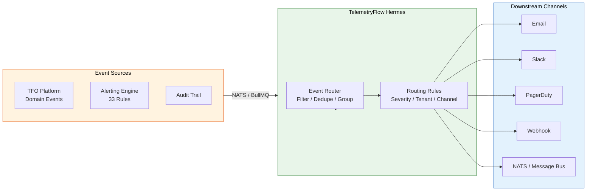
```mermaid
flowchart LR
    subgraph Sources["Event Sources"]
        PLATFORM["TFO Platform<br/>Domain Events"]
        ALERT["Alerting Engine<br/>33 Rules"]
        AUDIT["Audit Trail"]
    end

    subgraph Hermes["TelemetryFlow Hermes"]
        ROUTER["Event Router<br/>Filter / Dedupe / Group"]
        RULES["Routing Rules<br/>Severity / Tenant / Channel"]
    end

    subgraph Channels["Downstream Channels"]
        EMAIL["Email"]
        SLACK["Slack"]
        PD["PagerDuty"]
        WEBHOOK["Webhook"]
        NATS_OUT["NATS / Message Bus"]
    end

    Sources -->|"NATS / BullMQ"| Hermes
    Hermes --> ROUTER --> RULES
    RULES --> EMAIL
    RULES --> SLACK
    RULES --> PD
    RULES --> WEBHOOK
    RULES --> NATS_OUT

    style Sources fill:#fff3e0,stroke:#e65100,color:#000
    style Hermes fill:#e8f5e9,stroke:#2e7d32,color:#000
    style Channels fill:#e3f2fd,stroke:#1565c0,color:#000
```

### Key Features

- **Multi-source ingestion** — Subscribes to platform domain events, alert evaluations, and audit records
- **Fan-out routing** — One event → many channels with per-channel formatting
- **Alert fatigue control** — Deduplication, grouping, and silencing windows before delivery
- **Pluggable channels** — Email, Slack, PagerDuty, generic Webhook, and message-bus fan-out
- **Tenant-aware** — Routes respect the Region → Organization → Workspace → Tenant hierarchy

---

## Quick Start

### Prerequisites

- **Node.js** 20+ & **pnpm** 9+
- **Docker** & **Docker Compose**
- **Go** 1.24+ (for Agent/Collector development)

### Local Development

```bash
# 1. Clone the platform monolith
git clone https://github.com/telemetryflow/telemetryflow-platform.git
cd telemetryflow-platform

# 2. Start infrastructure
docker-compose --profile core up -d

# 3. Install dependencies
pnpm install

# 4. Run migrations & seed data
pnpm db:migrate
pnpm db:seed

# 5. Start development servers
pnpm dev
```

### Access Points

| Service            | URL                            |
| ------------------ | ------------------------------ |
| Frontend Dashboard | http://localhost:8080          |
| Backend API        | http://localhost:3000/api/v2   |
| API Documentation  | http://localhost:3000/api/docs |
| Health Check       | http://localhost:3000/health   |
| ClickHouse         | http://localhost:8123          |

### Application Instrumentation

**Python:**

```bash
pip install telemetryflow-python-sdk
```

```python
from telemetryflow import TelemetryFlow

tfo = TelemetryFlow(
    endpoint="http://localhost:4318",
    api_key="your-api-key"
)
tfo.init()  # Auto-instruments Flask/FastAPI/Django
```

**Go:**

```bash
go get github.com/telemetryflow/telemetryflow-go-sdk
```

```go
import tfo "github.com/telemetryflow/telemetryflow-go-sdk"

func main() {
    sdk, _ := tfo.NewBuilder().
        WithEndpoint("localhost:4318").
        WithAPIKey("your-api-key").
        Build()
    defer sdk.Shutdown()
    // Auto-instruments net/http, gin, echo, grpc
}
```

---

## Repository Map

```
TelemetryFlow/
├── telemetryflow-platform/        # Core platform (NestJS + Vue 3)
│   ├── backend/                            # NestJS API (DDD/CQRS)
│   │   └── src/modules/                   # 25+ business modules
│   ├── frontend/                           # Vue 3 dashboard
│   │   └── src/
│   │       ├── views/                      # 16 feature views
│   │       ├── registry/                   # Component registries (459 entries)
│   │       ├── composables/                # Vue composables
│   │       └── store/                      # Pinia stores
│   └── docker-compose.yml                  # Full-stack Docker setup
│
├── telemetryflow-agent/                    # Infrastructure agent (Go)
│   ├── cmd/                               # Entry points
│   ├── internal/
│   │   ├── collector/                      # Node, K8s, cAdvisor, DB, eBPF collectors
│   │   └── agent/                          # Agent lifecycle
│   ├── deploy/helm/                        # Helm charts
│   └── configs/                            # One-for-all config
│
├── telemetryflow-collector/                # OTLP collector (Go, OCB)
│   ├── components/                         # TFO custom OCB components
│   ├── cmd/                               # Collector entry point
│   └── configs/                            # Pipeline configs
│
├── telemetryflow-operator/                 # K8s Operator for TFO Platform
├── telemetryflow-core/                     # Shared libraries & types
├── telemetryflow-uptime/                   # Synthetic checks / availability
├── telemetryflow-kubernetes/               # Helm charts & K8s manifests
├── telemetryflow-deployment/               # Deployment automation (Docker/K8s/IaC)
├── telemetryflow-hermes/                   # AI agent & event message router
├── telemetryflow-itsm/                     # IT Service Management (ticketing, change, assets)
├── telemetryflow-cyberdefense/             # Threat detection & security analytics
├── telemetryflow-python-sdk/               # Python SDK
├── telemetryflow-go-sdk/                   # Go SDK
├── telemetryflow-viz/                      # Standalone viz dashboard
├── telemetryflow-go-mcp/                   # Go MCP server (Claude AI)
├── telemetryflow-python-mcp/               # Python MCP server (Claude AI)
├── telemetryflow-overview/                 # Documentation hub
└── telemetryflow-product/                  # Product summary (this repo)
```

---

## Project Statistics

| Metric                        | Count           |
| ----------------------------- | --------------- |
| Backend Modules               | 25+ (DDD/CQRS)  |
| Frontend Component Registry   | 459 entries     |
| API Endpoints                 | 120+            |
| Database Collectors           | 9 databases     |
| 3rd Party Integrations        | 39+             |
| eBPF Metrics                  | 28 kernel-level |
| ClickHouse Materialized Views | 24              |
| Queue Workers                 | 6 (BullMQ)      |
| Ecosystem Repositories        | 20+             |

---

## Contributing

We welcome contributions! Please see the individual repository CONTRIBUTING.md files for guidelines.

- **License**: Apache 2.0
- **Built by**: [Telemetri Data Indonesia](https://telemetryflow.id)
- **Website**: [telemetryflow.id](https://telemetryflow.id)
- **Docs**: [docs.telemetryflow.id](https://docs.telemetryflow.id)

---

<div align="center">

**Built with ❤️ by [Telemetri Data Indonesia](https://github.com/telemetryflow)**

**Version**: 1.4.2 | **Status**: Production Ready | **License**: Apache 2.0

---

⭐ **Star this repository** if you find it useful!

🐛 **Report bugs** via [GitHub Issues](https://github.com/telemetryflow/telemetryflow-platform/issues)

💡 **Share ideas** via [GitHub Discussions](https://github.com/telemetryflow/telemetryflow-platform/discussions)

</div>
