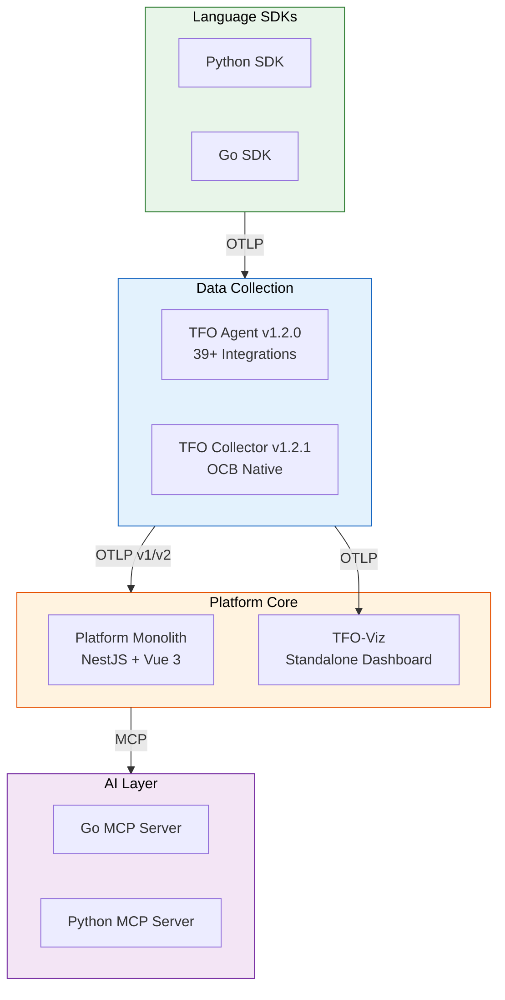
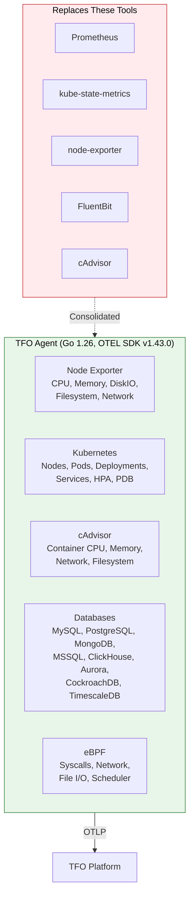
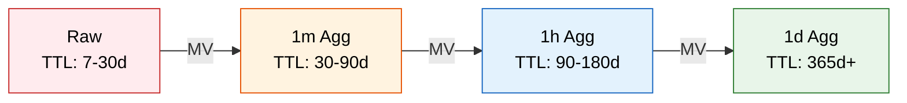

<div align="center">
  <picture>
    <source media="(prefers-color-scheme: dark)" srcset="https://github.com/telemetryflow/.github/raw/main/docs/assets/tfo-logo-dark.svg">
    <source media="(prefers-color-scheme: light)" srcset="https://github.com/telemetryflow/.github/raw/main/docs/assets/tfo-logo-light.svg">
    
  </picture>

  <h3>Community Enterprise Observability Platform (CEOP)</h3>

  <p>
    <strong>100% OpenTelemetry Compliant</strong> &bull;
    Built with <strong>DDD/CQRS</strong> &bull;
    Production-Ready &bull;
    Apache 2.0 Licensed
  </p>

[](#)
[](#)
[](https://nestjs.com/)
[](https://vuejs.org/)
[](https://golang.org/)
[](https://www.typescriptlang.org/)
[](https://clickhouse.com/)
[](https://opentelemetry.io/)

</div>

---

## What is TelemetryFlow?

**TelemetryFlow** is an **enterprise-grade, open-source observability platform** that provides unified telemetry collection, storage, analysis, and visualization. It is **100% OpenTelemetry Protocol (OTLP) compliant**, designed as an open-source alternative to commercial solutions like Datadog, New Relic, and Dynatrace.

### Why Choose TelemetryFlow?

**OpenTelemetry Native**
- 100% OTLP Compliance — Full support for metrics, logs, traces, and exemplars
- Zero Vendor Lock-in — Standard OpenTelemetry SDKs and collectors
- Dual Endpoint Support — Community v1 + Platform v2 on same collector

**Enterprise Architecture**
- Domain-Driven Design — 25+ bounded contexts with clear module isolation
- CQRS Implementation — Optimized read/write with 40+ command/query handlers
- Event-Driven — NATS + BullMQ hybrid messaging for real-time events
- Multi-Tenancy — Hierarchical isolation (Region → Organization → Workspace → Tenant)

**Security First**
- 5-Tier RBAC System — Granular role-based access control
- AWS-Style API Keys — Dual-key authentication (tfk-*/tfs-*) with Argon2id hashing
- MFA + SSO — TOTP, Google, GitHub, Azure AD, Okta, SAML, OIDC
- Complete Audit Trail — Every action logged to ClickHouse

---

## Product Ecosystem



### Ecosystem Components

| Repository | Language | Description |
|-----------|----------|-------------|
| [telemetryflow-platform](https://github.com/telemetryflow/telemetryflow-platform) | TypeScript (NestJS + Vue 3) | Core platform — backend API, frontend dashboard, dual database |
| [telemetryflow-agent](https://github.com/telemetryflow/telemetryflow-agent) | Go 1.26 | Infrastructure agent — replaces Prometheus, KSM, node-exporter, FluentBit |
| [telemetryflow-collector](https://github.com/telemetryflow/telemetryflow-collector) | Go 1.26 | OCB-native OTLP collector with TFO custom components |
| [telemetryflow-python-sdk](https://github.com/telemetryflow/telemetryflow-python-sdk) | Python 3.12+ | Python SDK for instrumenting applications |
| [telemetryflow-go-sdk](https://github.com/telemetryflow/telemetryflow-go-sdk) | Go 1.24+ | Go SDK for instrumenting applications |
| [telemetryflow-viz](https://github.com/telemetryflow/telemetryflow-viz) | TypeScript (Vue 3) | Standalone observability visualization dashboard |
| [telemetryflow-go-mcp](https://github.com/telemetryflow/telemetryflow-go-mcp) | Go | MCP server for Claude AI integration |
| [telemetryflow-python-mcp](https://github.com/telemetryflow/telemetryflow-python-mcp) | Python | MCP server for Claude AI integration |
| [telemetryflow-overview](https://github.com/telemetryflow/telemetryflow-overview) | Markdown | Comprehensive platform documentation |

---

## TFO Agent v1.2.0

The TFO Agent consolidates multiple monitoring tools into a single Go binary:



**Key Capabilities:**
- 9 database collectors (MySQL, PostgreSQL, MongoDB, MSSQL, ClickHouse, CockroachDB, Aurora, TimescaleDB, SQLite3)
- 28 eBPF kernel-level metrics across 7 categories
- 39+ third-party integrations (Cloud, APM, OSS Observability, Streaming, Network)
- Docker container monitoring (32 per-container metrics)
- Disk-backed buffer for offline resilience
- Cross-platform: Linux, macOS, Windows

---

## TFO Collector v1.2.1

Enterprise-grade OTLP collector built on **OpenTelemetry Collector Builder (OCB)** with 85+ community components and 4 custom TFO components:

| Component | Type | Description |
|-----------|------|-------------|
| `tfootlp` | Receiver | OTLP receiver with v1/v2 dual endpoint support |
| `tfo` | Exporter | Platform exporter with automatic auth header injection |
| `tfoauth` | Extension | API key management for TFO authentication |
| `tfoidentity` | Extension | Collector identity and resource enrichment |

**Pipeline Architecture:**
- **Traces**: tfootlp → k8sattributes → batch → tfo + spanmetrics + servicegraph
- **Metrics**: tfootlp → k8sattributes → transform → batch → tfo + prometheus
- **Logs**: tfootlp → k8sattributes → batch → tfo

---

## Platform Capabilities

### Monitoring Modules (25+ Backend Modules)

| Category | Modules |
|----------|---------|
| **Core** | Auth, IAM, Tenancy, Cache |
| **Telemetry** | Metrics, Logs, Traces, Exemplars, Correlations |
| **Monitoring** | Agent, Kubernetes, VM, Uptime, Status Page, Service Map, Network Map, DB Monitoring |
| **Platform** | Dashboard, Alerting, Retention, Subscription, API Keys, Notification, SSO, Audit |
| **Intelligence** | AI Intelligence, LLM, Query (TFQL), Data Masking |
| **Reporting** | Reporting |

### Database Monitoring

Query Analytics (QAN) with native collectors for 9 databases:
- **MySQL/MariaDB/Percona** — InnoDB, replication, Galera, query analytics
- **PostgreSQL** — pg_stat_statements, activity, bgwriter, replication
- **Amazon Aurora** — 60+ CloudWatch metrics via AWS SDK
- **MongoDB** — Server status, replica set, sharding, profiler
- **MSSQL** — Wait stats, perf counters, query store, index usage
- **ClickHouse, CockroachDB, TimescaleDB, SQLite3**

### Component Registry System

| Registry | Entries | ID Scheme |
|----------|---------|-----------|
| Graph Registry | 260+ | XXX1#### |
| Stat Panel Registry | 158 | XXX2#### |
| DataTable Registry | 41 | XXX3#### |

**459 total** registry entries across 23 module codes, rendered by Vue composables → 13 chart types via `RegistryGraphPanel` (3 variants: default/mini/panel).

### Data Architecture



---

## Quick Start

```bash
# Clone and setup
git clone https://github.com/telemetryflow/telemetryflow-platform.git
cd telemetryflow-platform

# Start infrastructure
docker-compose --profile core up -d

# Install, migrate, seed
pnpm install && pnpm db:migrate && pnpm db:seed

# Start development
pnpm dev
```

| Service | URL |
|---------|-----|
| Frontend Dashboard | http://localhost:8080 |
| Backend API | http://localhost:3000/api/v2 |
| API Documentation | http://localhost:3000/api/docs |
| Health Check | http://localhost:3000/health |

---

## Project Statistics

| Metric | Count |
|--------|-------|
| Backend Modules | 25+ (DDD/CQRS) |
| Frontend Component Registry | 459 entries |
| API Endpoints | 120+ |
| Database Collectors | 9 databases |
| 3rd Party Integrations | 39+ |
| eBPF Metrics | 28 kernel-level |
| ClickHouse Materialized Views | 24 |
| Queue Workers | 6 (BullMQ) |

---

## Technology Stack

| Layer | Technology |
|-------|-----------|
| **Frontend** | Vue 3, TypeScript, Pinia, Naive UI, ECharts 5.x, Vite 6.x |
| **Backend** | NestJS 11.x, TypeORM, BullMQ, NATS |
| **Databases** | PostgreSQL 16, ClickHouse 23+, Redis 7+ |
| **Agent** | Go 1.26, OTEL SDK v1.43.0 |
| **Collector** | Go 1.26, OCB (Core v1.58.0, Contrib v0.152.0) |
| **Deployment** | Docker Compose, Kubernetes + Helm |

---

## Contributing

We welcome contributions! See individual repository CONTRIBUTING.md files for guidelines.

- **License**: Apache 2.0
- **Built by**: [DevOpsCorner Indonesia](https://devopscorner.id)
- **Website**: [telemetryflow.id](https://telemetryflow.id)
- **Docs**: [docs.telemetryflow.id](https://docs.telemetryflow.id)

---

<div align="center">

**Built with ❤️ by [DevOpsCorner Indonesia](https://github.com/devopscorner)**

**Version**: 1.4.0 | **Status**: Production Ready | **License**: Apache 2.0

---

⭐ **Star this repository** if you find it useful!

🐛 **Report bugs** via [GitHub Issues](https://github.com/telemetryflow/telemetryflow-platform/issues)

💡 **Share ideas** via [GitHub Discussions](https://github.com/telemetryflow/telemetryflow-platform/discussions)

</div>
